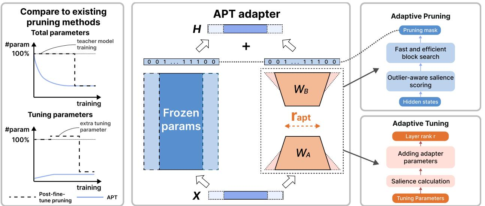
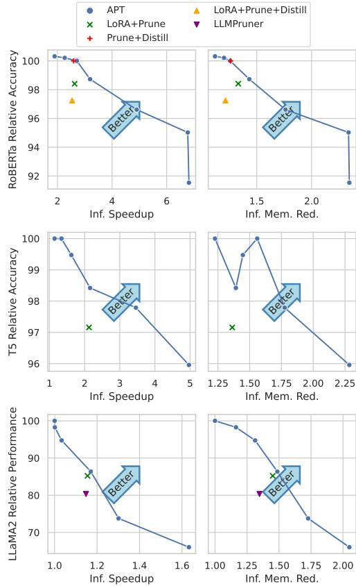
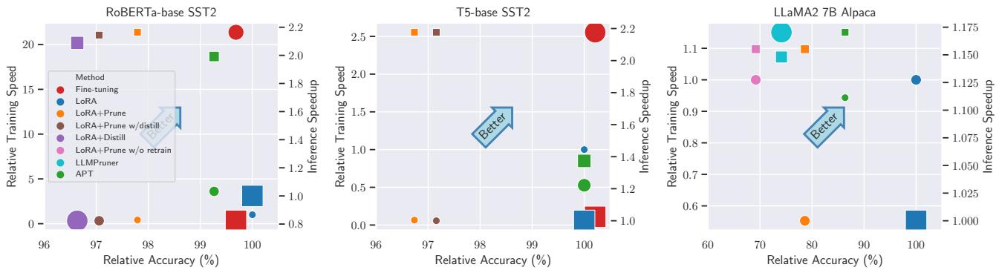
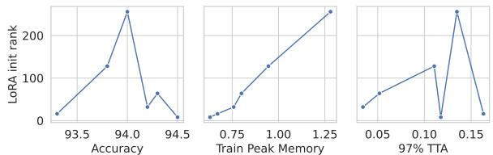
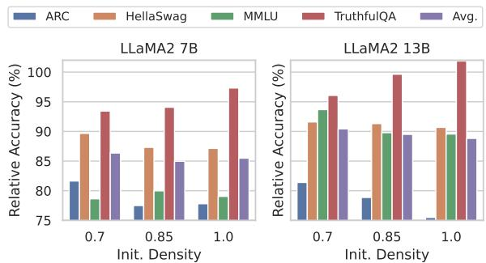

# APT: Adaptive Pruning and Tuning Pretrained Language Models for Efficient Training and Inference

Bowen Zhao 1 Hannaneh Hajishirzi 1 2 Qingqing Cao∗ 3

# Abstract

Fine-tuning and inference with large Language Models (LM) are generally known to be expensive. Parameter-efficient fine-tuning over pretrained LMs reduces training memory by updating a small number of LM parameters but does not improve inference efficiency. Structured pruning improves LM inference efficiency by removing consistent parameter blocks, yet often increases training memory and time. To improve both training and inference efficiency, we introduce APT that adaptively prunes and tunes parameters for the LMs. At the early stage of finetuning, APT dynamically adds salient tuning parameters for fast and accurate convergence while discarding unimportant parameters for efficiency. Compared to baselines, our experiments show that APT maintains up to $98 \%$ task performance when pruning $60 \%$ of the parameters in RoBERTa and T5 models. APT also preserves $8 6 . 4 \%$ of LLaMA models’ performance with $70 \%$ parameters remaining. Furthermore, APT speeds up LMs’ fine-tuning by up to $8 \times$ and reduces large LMs’ memory training footprint by up to $70 \%$ Our code and models are publicly available at https://github.com/ROIM1998/APT.

  
Figure 1. APT provides both training and inference efficiency benefits by pruning and tuning pretrained LM parameters adaptively via the APT adapter. We dynamically adjust (add/reduce) APT adapter input/output dimensions and the rank $( r _ { \mathrm { a p t } } )$ . Reducing adapter dimensions prunes frozen parameters, making training and inference faster and more memory-efficient. Adding adapter ranks helps recover the pruned LM’s task performance. In contrast, existing adapters like LoRA allow efficient training but do not provide inference efficiency since the model size is not reduced.

a 13B LLaMA model (Touvron et al., 2023) costs about 100GB memory for fine-tuning and 30GB for inference with float16 datatype. It is important to improve the training and inference efficiency of LM for practical applications.

# 1. Introduction

Fine-tuning language models (LMs) (Devlin et al., 2019; Liu et al., 2019; Raffel et al., 2020) is an essential paradigm to adapt them to downstream tasks (Mishra et al., 2022; Wang et al., 2022b). Increasing the parameter scale of LMs improves model performance (Kaplan et al., 2020), but incurs significant training and inference costs. For instance,

Parameter-efficient fine-tuning methods (PEFT, summarized in Table 1) (Houlsby et al., 2019; Li & Liang, 2021) reduce the memory consumption of LM fine-tuning via updating a small number of parameters. However, PEFT models do not improve inference efficiency because the LM size remains the same or even increases after fine-tuning. For instance, LoRA (Hu et al., 2022) tunes low-rank decomposed linear layers parallel to frozen parameters to reduce training memory but takes longer to converge (Ding et al., 2023). On the other hand, structured pruning (Kwon et al., 2022; Xia et al., 2022; Ma et al., 2023) improves inference efficiency by removing blocks of parameters such as attention heads and feed-forward neurons in Transformer LMs, showing more inference speedup than sparse unstructured pruning methods (Han et al., 2016; 2015; Sanh et al., 2020). However, training pruned LMs takes extra time to converge and incurs high memory, substantially diminishing LMs’ accessibility in usage scenarios with limited computational resources.

Integrating structured pruning and PEFT could increase both training and inference efficiency. However, existing research (Zhao et al., 2023) indicates that combining PEFT and structured pruning, such as applying structured pruning over LoRA-tuned models, causes noticeable performance loss and extra training costs. It remains challenging to prune LMs accurately using limited training resources.

<table><tr><td rowspan="2">Method</td><td rowspan="2"></td><td rowspan="2">Ap</td><td rowspan="2">AT</td><td colspan="2">Training</td><td colspan="2">Inference</td></tr><tr><td>T</td><td>M</td><td>T</td><td>M</td></tr><tr><td rowspan="3">PEFT</td><td>Adapter (Pfeiffer et al., 2021)</td><td>×</td><td></td><td>介High</td><td>↓Low</td><td>介Low</td><td>介Low</td></tr><tr><td>LoRA (Hu et al.,2022)</td><td>×</td><td>×</td><td>介High</td><td>Low</td><td>=</td><td>=</td></tr><tr><td>AdaLoRA (Zhang et al., 2023b)</td><td>X</td><td>√</td><td>介High</td><td>↓Low</td><td>=</td><td>=</td></tr><tr><td rowspan="4">Pruning</td><td>MvP (Sanh et al., 2020)</td><td>×</td><td>X</td><td>介High</td><td>介Low</td><td>√Low</td><td>Low</td></tr><tr><td>BMP (Lagunas et al.,2021)</td><td>×</td><td>X</td><td>介High</td><td>介Low</td><td>High</td><td>↓Low</td></tr><tr><td>CoFi (Xia et al., 2022)</td><td>×</td><td></td><td>介High</td><td>介Low</td><td>High</td><td>Low</td></tr><tr><td>MT (Kwon et al., 2022)</td><td>X</td><td>×</td><td>=</td><td>=</td><td>High</td><td>Low</td></tr><tr><td rowspan="3">Combined</td><td>SPA (Hedegaard etal., 2022)</td><td>X</td><td>X</td><td>介High</td><td>介Low</td><td>√High</td><td>√Low</td></tr><tr><td>LRP (Zhang et al., 2023a)</td><td>X</td><td>X</td><td>介High</td><td>↓Low</td><td>High</td><td>√Low</td></tr><tr><td>APT (ours)</td><td>√</td><td>√</td><td>介Low</td><td>Low</td><td>High</td><td>√Low</td></tr></table>

In this paper, we develop an efficient fine-tuning approach named APT that Adaptively selects model parameters for Pruning and fine-Tuning. APT combines the benefits of PEFT and structured pruning to make fine-tuning and inference more efficient. Our intuition is that pre-trained LM parameters contain general knowledge, but their importance to downstream tasks varies. Therefore, we can remove the parameters irrelevant to the fine-tuning task in the early training stage. Early-removing these parameters improves training and inference efficiency while not substantially hurting model accuracy (Frankle et al., 2021; Shen et al., 2022a; Zhang et al., 2023c). Meanwhile, continuously adding more parameters for fine-tuning can improve LM performance because task-specific skills live in a subset of LM parameters (Wang et al., 2022a; Panigrahi et al., 2023).

More specifically, APT learns the pruning masks via an outlier-aware salience scoring function to remove irrelevant LM parameter blocks and adds more tuning parameters during fine-tuning according to tuning layer importance. To make training more efficient, the salience scoring function is lightweight and causes little runtime and memory overhead. Combined with our self-distillation technique that shares teacher and student parameters, APT can accurately prune an LM with less training time and lower memory usage.

Experimental results show that APT prunes RoBERTa and T5 base models $8 \times$ faster than the LoRA plus pruning baseline while reaching $9 8 . 0 \%$ performance with $2 . 4 \times$ speedup and $7 8 . 1 \%$ memory consumption during inference. When pruning large LMs like LLaMA, APT costs only $30 \%$ memory compared to the state-of-the-art pruning method and still maintains $8 6 . 4 \%$ performance with $70 \%$ parameters. Our ablation study in Section 5.6 indicates the effectiveness of adaptive pruning and tuning. It also demonstrates that efficient distillation with APT adapter substantially recovers small LMs’ performance while outlier-aware salience scoring prunes large LMs more accurately. Our analysis in Appendix H demonstrates that controlled adaptive tuning with early pruning during fine-tuning improves LM end-task accuracy better with less training time and memory costs.

# 2. Related Works

# 2.1. Parameter-efficient Fine-tuning (PEFT)

PEFT methods aim to tune LMs with limited resources by updating a small number of parameters (Lialin et al., 2023), mainly falling into three categories: selective, additive, and dynamic. Selective methods focus on tuning a subset of parameters in LMs with pre-defined rules (Ben Zaken et al., 2022) or importance metrics (Sung et al., 2021; Guo et al., 2021). Additive methods tune injected layer modules (Houlsby et al., 2019; Pfeiffer et al., 2021) or embeddings (Lester et al., 2021; Li & Liang, 2021). For example, LoRA (Hu et al., 2022) tunes low-rank decomposed layers to avoid inference cost overhead. However, LoRA keeps the tuning layer shapes static without dynamic adjustments. Dynamic methods (He et al., 2022b) adjust tuning parameters during training. For instance, AdaLoRA (Zhang et al., 2023b) gradually reduces tuning parameters but does not benefit inference efficiency. Compared to these methods, APT adaptively adjusts the pruning and tuning parameters simultaneously, improving training and inference efficiency.

# 2.2. Model Compression

Model compression methods like quantization and pruning boost inference efficiency. Quantization aims to reduce LMs’ memory consumption via converting parameters to low-bit data types (Frantar et al., 2023; Dettmers et al., 2022; Lin et al., 2023). However, despite reducing LM’s memory consumption, the speedup benefits of quantization require specific framework support, which limits their adaptability. Pruning (LeCun et al., 1989; Han et al., 2016; Frankle & Carbin, 2019; Xu et al., 2021) aims to discard unimportant parameters in LMs for inference efficiency. Unstructured pruning (Sanh et al., 2020) prunes sparse parameters in LMs, which requires dedicated hardware support for efficiency improvements. Meanwhile, structured pruning (Lagunas et al., 2021; Xia et al., 2022) prunes consistent blocks in transformer layers (MHA heads, FFN neurons, and model dimensions) for ubiquitous inference efficiency gains. Such pruning often uses knowledge distillation (Hinton et al., 2015), which causes more training costs. Post-training pruning (Kwon et al., 2022; Frantar & Alistarh, 2023) aims to prune fine-tuned models with limited extra costs but requires initialization from fully fine-tuned models. Moreover, taskagnostic pruning (Sun et al., 2023; Ma et al., 2023) cannot achieve on-par performance with task-specific pruning.

# 2.3. Combining Compression and PEFT

Combining model compression and PEFT might achieve both training and inference efficiency improvements: QLoRA (Dettmers et al., 2023) and QA-LoRA (Xu et al., 2023) bring quantization and LoRA together for large LM tuning. SPA (Hedegaard et al., 2022) combines structured pruning and Compacter (Mahabadi et al., 2021), yet suffers substantial performance loss. CPET (Zhao et al., 2023) leverages different task-agnostic model compression methods together with LoRA and knowledge distillation, but the performance loss becomes notable specifically when structured pruning is applied. PST (Li et al., 2022) and LRP (Zhang et al., 2023a) also explored the combination of LoRA and pruning, yet their performance degradations are also substantial because their tuning parameters are static. In contrast, APT identifies tuning and pruning parameters based on their salience in fine-tuning, which can improve training and inference efficiency under a new paradigm with minimal performance loss.

# 3. Problem Formulation

Our goal is to improve the training and inference efficiency of pretrained LM while maintaining task performance. Intuitively, tuning fewer parameters leads to smaller training memory footprints and shorter time per training step; models with fewer parameters also run faster with less memory footprint during inference but come with task performance degradation. We aim to find the optimal parameters for training and inference without sacrificing task performance.

We formally define the problem objective as minimizing the task loss $\mathcal { L }$ under the constraint that the total LM parameter size $\Theta$ reaches a target sparsity (defined as the ratio of the number of parameters pruned to the original LM) $\gamma _ { T }$ after $T$ training steps. For each training step $t$ , the sparsity of the LM remains above $\gamma _ { t }$ while the number of tuning parameters is below $\Delta _ { t }$ . We control the pruning masks $\mathcal { M } _ { t }$ and tuning ranks $\mathcal { R } _ { t }$ to satisfy these constraints. We describe the optimization process as:

$$
\begin{array} { r l } { \underset { \boldsymbol { \Theta } _ { T } , \boldsymbol { \mathcal { M } } _ { T } } { \mathrm { a r g m i n } } } & { \displaystyle \frac { 1 } { | \mathcal { D } | } \displaystyle \sum _ { \boldsymbol { x } , \boldsymbol { y } \in \mathcal { D } } \mathcal { L } ( \boldsymbol { x } , \boldsymbol { y } | \Theta _ { T } , \mathcal { M } _ { T } ) } \\ { \mathrm { s . t . } \quad } & { 1 - \frac { \mathcal { C } ( \Theta _ { t } , \mathcal { M } _ { t } ) } { \mathcal { C } ( \Theta _ { 0 } , \mathcal { M } _ { 0 } ) } \geq \gamma _ { t } , } \\ & { \delta ( \Theta _ { t } , \mathcal { M } _ { t } , \mathcal { R } _ { t } ) \leq \Delta _ { t } , } \\ & { \forall t \in \{ 0 , 1 , \ldots , T \} . } \end{array}
$$

where $x , y$ are inputs and labels sampled from the task dataset $\mathcal { D }$ , while $\mathcal { C }$ and $\delta$ denotes total and tuning parameter numbers of the LM, respectively.

Based on Equation (1), a higher target sparsity $\gamma _ { T }$ improves inference efficiency with fewer FLOPs and memory usage but sacrifices performance. Increasing $\gamma _ { t }$ when $t \ll T$ also improves training efficiency. Besides, tuning more parameters with larger $\Delta$ costs more training memory but makes the model converge faster with better task performance. Our formulation supports task performance improvements together with training and inference efficiency by dynamically adjusting the LM parameters during fine-tuning.

# 4. Adaptive Pruning and Tuning

We design Adaptive Pruning and Tuning (APT) over LM parameters to allow efficient training and inference while maintaining task performance.

Summarized in the left of Figure 2, existing pruning methods often neglect training costs where the number of tuning parameters is more than a parameter-efficient threshold with $\Delta _ { t } \geq \mathcal { C } ( \Theta _ { t } , \mathcal { M } _ { t } )$ , resulting in long training time and high memory consumption. Instead, to improve training efficiency, we prune LM parameters (increase $\gamma _ { t }$ ) during early training when $t \ll T$ while keeping $\Delta _ { t } \ll \mathcal { C } ( \Theta _ { t } , \mathcal { M } _ { t } )$ to reduce training costs. In addition, we add tuning parameters (increase $\Delta _ { t }$ ) in early training to effectively mitigate the degradation of LM’s performance due to pruning.

Overview. Figure 2 shows the overview of our method that incorporates our new APT adapter for pruning and tuning. Our intuition is that pruning LMs during early fine-tuning will not hurt their task performance while reducing training and inference costs. Meanwhile, unlike existing adapters like LoRA (Hu et al., 2022) that use fixed tuning parameters, APT adapters dynamically add tuning parameters to accelerate LM convergence with superior task performance. We first introduce the architecture of APT adapters in Section 4.1. We then describe how we prune LM parameters at early fine-tuning with low cost in Section 4.2 and adaptively tune LMs to recover task performance efficiently in Section 4.3. Additionally, we explain our self-knowledge distillation technique that improves pruned LM’s task performance with limited training expense in Section 4.4.

  
Figure 2. APT adaptively identifies pruning and tuning parameters via APT adapters during fine-tuning with little cost. APT gradually prunes LM parameters with binary pruning masks learned from our lightweight outlier-aware salience scoring function for training and inference efficiency. APT also adds tuning parameters in salient layers in LM fine-tuning through increasing dynamic ranks in APT adapters for performance recovery.

# 4.1. APT adapter

We build the APT adapter architecture over LoRA, but the key difference is that APT adapter supports dynamic LM pruning and tuning. Assuming an APT adapter projects the input $X \in \mathbb { R } ^ { d _ { i } }$ to the output $\bar { H } _ { \mathrm { a p t } } ( X ) \in \mathbb { R } ^ { \bar { d } _ { o } }$ , we design binary pruning masks $\mathbf { \bar { \Phi } } _ { m _ { i } } \in \mathbb { R } ^ { d _ { i } }$ for input and $m _ { o } \in \mathbb { R } ^ { \bar { d } _ { o } }$ for output) and dynamic ranks $r _ { \mathrm { a p t } }$ in APT adapter to control the total and tuning LM parameters during fine-tuning, respectively. Specifically, with tuning parameters $W _ { A } \in \mathbb { R } ^ { r _ { \mathrm { a p t } } \times d _ { i } }$ and $W _ { B } \in \mathbb { R } ^ { d _ { o } \times r _ { \mathrm { a p t } } }$ , APT adapter $H _ { \mathrm { a p t } }$ is denoted as:

$$
H _ { \mathrm { a p t } } ( X ) = m _ { o } \circ ( W + s \cdot W _ { B } W _ { A } ) X \circ m _ { i }
$$

where $s$ is the constant scaling factor following LoRA’s implementation, and $\circ$ denotes the Hadamard product between the masks and their corresponding matrices. The parameter block is pruned when the multiplying mask is set to 0 and retained when set to 1. In the meantime, during fine-tuning, we dynamically increase $r _ { \mathrm { a p t } }$ for the weight matrices $W _ { B }$ and $W _ { A }$ . Compared to LoRA, APT adapters can be more efficient due to more adaptive pruning and tuning over LM parameters.

In transformer-based LM fine-tuning, we add APT adapters in queries and values of multi-head attention (MHA) layers. We also add APT adapter in feed-forward network (FFN) layers when fine-tuning smaller models like RoBERTa and T5 for fast training convergence. In these cases, $m _ { i }$ prunes transformers’ hidden dimension and $m _ { o }$ prunes attention heads in MHA and internal neurons in FFN layers. By learning the pruning masks and adjusting the ranks dynamically in the APT adapter, we can achieve the goal defined in Section 3 where the tuning parameter number $\delta ( \Theta _ { t } , \mathcal { M } _ { t } , \mathcal { R } _ { t } )$ increases to maintain task performance and the LM parameter size $\mathcal { C } ( \Theta _ { t } , \mathcal { M } _ { t } )$ decreases to support more efficient training and inference. Next, we describe the adaptive pruning and tuning procedures in detail.

# 4.2. Low-cost Adaptive LM Pruning $\left( \mathcal { A } _ { \mathbf { p } } \right)$

To benefit the efficiency of LM training and inference, APT adaptively prunes LM parameters since the start of finetuning. The problem is finding the parameters to be pruned and discarding them without hurting training stability. Given a task, we compute the outlier-aware salience score of parameter blocks at each early-training step when $t \ll T$ Afterward, we use a fast search algorithm to determine the parameters to be pruned, and then we update their binary pruning masks accordingly. The upper-right of Figure 2 shows this adaptive pruning procedure.

Outlier-aware salience scoring of LM parameters. When determining the influence of pruning parameters on the LM performance for fine-tuning tasks, the key idea is to compute the outlier-aware salience scores of LM activations to consider both tuning and frozen parameters. In detail, salience is defined as the magnitude of parameters’ weight-gradient production from previous works (Sanh et al., 2020), where

$$
S ( W _ { i , j } ) = | W _ { i , j } \cdot \frac { \partial \mathcal { L } } { \partial W _ { i , j } } |
$$

However, since the frozen weights’ gradients are unreachable in PEFT settings, we compute the salience as the magnitude of the product of activations and their gradients. Additionally, we compress the activation and gradients by summing along batches before production to further reduce the training memory consumption. On the other hand, block outlier parameters play a crucial role in task-specific capabilities, as previous quantization methods suggest (Dettmers et al., 2022; Lin et al., 2023). Such effects brought by outlier parameters will be averaged if salience is only measured on the block level. To keep more outlier parameters in the pruned LMs, we combine the salience score above and the kurtosis1 of the activation together. Therefore, given the supervised finetuning dataset $\mathcal { D } _ { t }$ , the outlier-aware salience score $\hat { S }$ is defined as:

$$
\begin{array} { r l } & { \widetilde { S } _ { t } ( W _ { : , j } ) = \displaystyle \sum _ { ( x , y ) \in \mathcal { D } _ { t } } \sum _ { i } \vert \frac { \partial \mathcal { L } ( x , y \vert \Theta _ { t } , \mathcal { M } _ { t } ) } { \partial H _ { j , i } } \vert \cdot } \\ & { \qquad \displaystyle \sum _ { ( x , y ) \in \mathcal { D } _ { t } } \sum _ { i } \vert H _ { j , i } \vert } \\ & { \qquad \quad \widehat { S } ( ( W _ { : , j } ) = \widetilde { S } ( W _ { : , j } ) + ( \mathrm { K u r t } ( O _ { j , : } ) ) ^ { \frac { 1 } { 2 } } } \end{array}
$$

where $H$ is the activations in the LM, $\mathrm { K u r t } ( \cdot )$ stands for kurtosis, and $O _ { : , j } = W _ { : , j } \circ X _ { j , } ^ { \intercal }$ represents the activation. We leave details of the salience scoring in Appendix B.

Efficient search of LM block parameters. Given the salience calculated in Equation (5), the next step is to learn the binary pruning masks to increase the LM sparsity above $\gamma _ { t }$ . Intuitively, we shall prune the blocks with less salience score, which formulates a latency-saliency knapsack (Shen et al., 2022b) task. For an LM with $n _ { L }$ transformer layers, where layer $i$ has $n _ { h } ^ { i }$ MHA heads and ${ n } _ { f } ^ { i }$ FFN neurons, and all transformer layers’ hidden dimension sizes are $d _ { m }$ , the approximated2 number LM parameter is:

$$
\mathcal { C } ( \Theta _ { t } ; \mathcal { M } _ { t } ) \approx d _ { m } \sum _ { i = 1 } ^ { n _ { L } } ( 4 n _ { h } ^ { i } \cdot d _ { h } + 2 n _ { f } ^ { i } )
$$

where $d _ { h }$ is the dimension per MHA head. To keep the constraint in Equation (1), we prune MHA heads, FFN neurons, and the model hidden dimension simultaneously by reducing $n _ { h } ^ { i } , n _ { f } ^ { i }$ , and $d _ { m }$ . Hence, we first sort the blocks by their salience divided by the parameter number. As the parameter size monotonically increases with block quantity, we use binary search to identify the top salient blocks to be retained given the sparsity constraint $\gamma _ { t }$ . We leave the implementation details in Appendix C for simplicity.

# 4.3. Adaptive and Efficient LM Tuning $\left( \mathcal { A } _ { \mathbf { T } } \right)$

As using PEFT methods to fine-tune pruned LMs causes notable performance decrease (illustrated in Table 2 and Table 4), we aim to dynamically add tuning parameters in LM fine-tuning to improve the model’s end-task performance. However, since more tuning parameters will consume extra training time and memory, we want to add parameters in a controlled way, where new parameters are only added to task-sensitive APT adapters. As a result, we can recover pruned LMs’ performance with reasonable training costs. In detail, we first calculate the salience of each APT adapter to determine their importance. Next, we select the top-half APT adapters after sorting them with salience and add their parameters by increasing their $r _ { \mathrm { a p t } }$ .

Salience scoring of APT adapter. Since gradients of tuning parameters information are available when determining the layer salience, we can first calculate each tuning parameter’s salience with Equation (3). Then, we define the salience of an APT adapter as the summation of the parameter salience scores in $W _ { B }$ , denoted as $\begin{array} { r } { \mathcal { T } ( H _ { \mathrm { a p t } } ) = \sum _ { i , j } S ( W _ { B i , j } ) } \end{array}$ , to represent each tuning APT adapter’s importance3. Given the calculated $\mathcal { T } ( H _ { \mathrm { a p t } } )$ for each APT adapter, we can then decide where to add new tuning parameters to efficiently improve the pruned LM’s task accuracy.

Dynamically adding APT adapter parameters to recover task performance. With the importance of APT adapters $\mathcal { T } ( H _ { \mathrm { a p t } } )$ calculated, the next step of adaptive tuning is to add tuning parameters by increasing the salient tuning layers’ ranks $r _ { \mathrm { a p t } } \in \mathcal { R } _ { t }$ following budget $\Delta _ { t }$ . Therefore, firstly, we sort all tuning layers according to their importance score $\mathcal { T } ( H _ { \mathrm { a p t } } )$ and linearly increase the ranks of the tophalf salient ones. More specifically, when increasing the tuning parameter from $\Delta _ { t }$ to $\Delta _ { t ^ { \prime } }$ , the salient layer’s rank is changed from rapt to r′apt = ⌊rapt · ∆ ∆t where $\lfloor \cdot \rfloor$ denotes the floor operation. For training stability, when adding parameters and converting $W _ { B } \in \mathbb { R } ^ { d _ { o } \times r _ { \mathrm { a p t } } }$ , $W _ { A } \in \mathbb { R } ^ { r _ { \mathrm { a p t } } \times d _ { i } }$ to $W _ { B } ^ { \prime } \in \mathbb { R } ^ { d _ { o } \times r _ { \mathrm { a p t } } ^ { \prime } } , W _ { A } ^ { \prime } \in \mathbb { R } ^ { r _ { \mathrm { a p t } } ^ { \prime } \times d _ { i } }$ , we concatenate random Gaussian initialized parameters ${ \mathcal { N } } ( 0 , \sigma ^ { 2 } )$ in $W _ { A }$ and zeros in $W _ { B }$ same as the LoRA initialization, so the layer’s output remains unchanged before and after new parameters added.

# 4.4. Efficient Self-Knowledge Distillation

As shown in Table 4, training pruned LM without knowledge distillation causes significant end-task performance drops. Therefore, we use knowledge distillation in APT to recover the pruned LM’s performance. Still, existing strategies require a fully trained teacher model being put into the GPU with the student during distillation, causing high training time and memory. To avoid extra training costs, we keep duplicating the tuning student layers as teachers during finetuning to reduce total training time. Meanwhile, frozen parameters are shared between the student and teacher model during training to reduce memory consumption. We edit the distillation objective in CoFi (Xia et al., 2022) as

$$
\begin{array} { c } { \mathcal { L } = \mu \mathcal { L } _ { d i s t i l l } + ( 1 - \mu ) \mathcal { L } _ { f t } } \\ { \mathcal { L } _ { l a y e r } = \displaystyle \sum _ { i = 1 } ^ { \mathcal { T } } \mathbf { M S E } ( \mathrm { T r } ( H _ { s } ^ { \phi ( i ) } ) , H _ { t } ^ { i } ) } \end{array}
$$

where $\mu$ is a moving term linearly scales from 0 to 1 during distillation to encourage the pre-pruned model vastly fit to the training data, $\mathcal { L } _ { d i s t i l l }$ is the distillation objective from CoFi, and $\mathcal { L } _ { f t }$ is the supervised fine-tuning objective. $\tau$ is block-wise randomly sampled teacher layers following (Haidar et al., 2022), $\phi ( \cdot )$ is the teacher-student layer-mapping function that matches the teacher layer to its closest, non-pruned student layer. Tr denotes the tunable LoRA layer for layer transformation, initialized as an identical matrix $\mathcal { T }$ . More implementation details of our self-distillation technique is introduced in Appendix A.

# 5. Experiments

To evaluate the training and inference efficiency gains of APT, we compare it with the combined use of PEFT with pruning and distillation baselines. We first describe the natural language understanding and generation tasks targeting different LM backbones, then the setup of baselines and APT. We then report task performance, speed, and memory usage for training and inference costs.

# 5.1. Tasks

We apply APT to BERT (Devlin et al., 2019), RoBERTa (Liu et al., 2019), T5(Raffel et al., 2020)4, and LLaMA (Touvron et al., 2023). For BERT, RoBERTa, and T5 models, we train and evaluate on SST2 and MNLI datasets from the GLUE benchmark (Wang et al., 2019) and report the dev set accuracy. We also train and evaluate $\mathrm { R o B E R T a _ { b a s e } }$ on $\mathrm { S Q u A D }$ v2.0 (Rajpurkar et al., 2018) and report the dev set F1 score. For T5 models, we also fine-tune them on CNN/DM (Nallapati et al., 2016) and report the ROUGE 1/2/L scores. Meanwhile, We use the GPT-4 generated Alpaca dataset (Taori et al., 2023) to fine-tune large LLaMA models and evaluate them with the lm-eval-harness package (Gao et al., 2023) on four tasks from the Open LLM Leaderboard, namely 25- shot ARC (Clark et al., 2018), 10-shot HellaSwag (Zellers et al., 2019), 5-shot MMLU (Hendrycks et al., 2021), and zero-shot TruthfulQA (Lin et al., 2022).

# 5.2. Baselines

We validate the efficiency benefits of APT for both training and inference by comparing with PEFT, pruning, and distillation methods, along with their combinations.

LoRA+Prune: a post-training pruning method over on LoRA-tuned LMs. We use Mask Tuning (Kwon et al., 2022), a state-of-the-art post-training structured pruning method based on fisher information. Due to that post-training pruning performs poorly on high-sparsity settings, we retrain the pruned LM after pruning to recover its performance.

Prune+Distill: knowledge distillation has been proved to be a key technique in recovering pruned LMs’ task accuracy. In particular, we use the state-of-the-art pruning plus distillation method called CoFi (Xia et al., 2022) which uses $L _ { 0 }$ regularization for pruning plus dynamic layer-wise distillation objectives. We only compare APT to CoFi with RoBERTa models since the training memory usage of CoFi is too high for larger LMs.

LoRA+Prune+Distill: to reduce the training memory consumption in pruning and distillation, a simple baseline is to conduct CoFi pruning and distillation but with LoRA parameters tuned only. More specifically, only the $L _ { 0 }$ module and LoRA parameters are tunable under this setting.

LLMPruner (Ma et al., 2023): LLMPruner is the state-ofthe-art task-agnostic pruning method on LLaMA that prunes its blocks or channels based on salience metrics while using LoRA for fast performance recovery. We compare APT to LLMPruner with fine-tuning on the same GPT-4 generated Alpaca data for fair comparisons.

We also compare APT to PST (Li et al., 2022) and LRP (Zhang et al., 2023a), which are the state-of-theart parameter-efficient unstructured and structured pruning methods on BERT model. We leave these results in Appendix D.

# 5.3. Evaluation Metrics

We evaluate APT and baselines on training and inference efficiency, measured in runtime memory and time consumption as follows:

Training Efficiency Metrics: we report relative training peak memory (Train. Mem.) and relative training speed measured by time to accuracy $( \mathrm { T T A } ^ { 5 } )$ (Coleman et al., 2019) compared to full finetuning. For fair comparisons, we consider the training time of the teacher model plus the student for methods using knowledge distillation.

Inference Efficiency Metrics: we report the inference peak memory (Inf. Mem.) and the relative speedup (Inf. Speed)

<table><tr><td>Model</td><td>Method</td><td>MNLI</td><td>SST2</td><td>SQuAD v2</td><td>CNN/DM</td><td>Train Time()</td><td>Train Mem(↓)</td><td>Inf Time()</td><td>Inf Mem()</td></tr><tr><td rowspan="6">RoBERTabase</td><td>FT</td><td>87.6</td><td>94.8</td><td>82.9</td><td>-</td><td>100.0%</td><td>100.0%</td><td>100.0%</td><td>100.0%</td></tr><tr><td>LoRA</td><td>87.5</td><td>95.1</td><td>83.0</td><td>-</td><td>2137.0%</td><td>60.5%</td><td>100.0%</td><td>100.0%</td></tr><tr><td>LoRA+Prune</td><td>84.0</td><td>93.0</td><td>79.2</td><td></td><td>5128.3%</td><td>60.5%</td><td>38.0%</td><td>75.1%</td></tr><tr><td>Prune+Distill</td><td>87.3</td><td>94.5</td><td>-</td><td>-</td><td>1495.3%</td><td>168.5%</td><td>38.6%</td><td>79.2%</td></tr><tr><td>LoRA+Prune+Distill</td><td>84.2</td><td>91.9</td><td>-</td><td></td><td>6534.6%</td><td>141.4%</td><td>39.4%</td><td>82.3%</td></tr><tr><td>APT</td><td>86.4</td><td>94.5</td><td>81.8</td><td>-</td><td>592.1%</td><td>70.1%</td><td>41.3%</td><td>78.1%</td></tr><tr><td rowspan="4">T5base</td><td>FT</td><td>87.1</td><td>95.2</td><td></td><td>42.1/20.3/39.4</td><td>100.0%</td><td>100.0%</td><td>100.0%</td><td>100.0%</td></tr><tr><td>LoRA</td><td>87.0</td><td>95.0</td><td></td><td>38.7/17.2/36.0</td><td>255.5%</td><td>62.0%</td><td>100.0%</td><td>100.0%</td></tr><tr><td>LoRA+Prune</td><td>80.9</td><td>92.3</td><td></td><td>36.7/15.7/33.9</td><td>4523.5%</td><td>62.0%</td><td>47.1%</td><td>73.4%</td></tr><tr><td>APT</td><td>87.0</td><td>95.0</td><td></td><td>38.6/17.0/35.8</td><td>484.7%</td><td>73.9%</td><td>74.6%</td><td>81.5%</td></tr></table>

Table 2. RoBERTa and T5 pruning with APT compared to baselines under $60 \%$ sparsity. We measure the training and inference efficiency with LMs pruned on the SST2 task. Training speed is measured via $9 7 \%$ accuracy TTA. All efficiency metrics are normalized to FT. ⇓ denotes smaller is better. The best-pruned results are bold. Raw efficiency results are reported in Table 11.   

<table><tr><td>Method</td><td>ARC</td><td>HellaSwag</td><td>MMLU</td><td>TruthfulQA</td><td>Avg.</td><td>Train Time(↓)</td><td>Train Mem ()</td><td>Inf Time(↓)</td><td>Inf Mem(↓)</td></tr><tr><td>LLaMA 2 7B</td><td>53.1</td><td>77.7</td><td>43.8</td><td>39.0</td><td>53.4</td><td>1</td><td></td><td>-</td><td>-</td></tr><tr><td>LoRA</td><td>55.6</td><td>79.3</td><td>46.9</td><td>49.9</td><td>57.9</td><td>100.0%</td><td>100.0%</td><td>100.0%</td><td>100.0%</td></tr><tr><td>LoRA+Prune</td><td>46.8</td><td>65.2</td><td>23.9</td><td>46.2</td><td>45.5</td><td>180.9%</td><td>100.0%</td><td>115.5%</td><td>68.9%</td></tr><tr><td>LLMPruner</td><td>39.2</td><td>67.0</td><td>24.9</td><td>40.6</td><td>42.9</td><td>86.9%</td><td>253.6%</td><td>114.8%</td><td>74.2%</td></tr><tr><td>APT</td><td>45.4</td><td>71.1</td><td>36.9</td><td>46.6</td><td>50.0</td><td>106.0%</td><td>75.8%</td><td>117.0%</td><td>67.2%</td></tr></table>

Table 3. LLaMA 2 7B $30 \%$ sparsity pruning results with GPT4-generated Alpaca dataset, evaluated on the Open LLM leaderboard few-shot tasks. Training speed is measured via training time per step. We do not compare to distillation baselines because the training cost of distillation is too large, and we also compare APT to LLMPruner since it is dedicated to large LM pruning. All efficiency metrics are normalized to LoRA. $\Downarrow$ denotes smaller is better. The best-pruned results are bold. Raw efficiency results are reported in Table 12.

based on throughput (data processed per second) for inference efficiency.

Both training and evaluation are conducted on a single A100 GPU. The inference test batch size is 128 for small models while 32 and 4 for LLaMA 7B and 13B models, respectively. We demonstrate detailed training and evaluation setups/implementations in Appendix A.

# 5.4. Main Results

Overview We demonstrate the end-task performance of APT comparing to fine-tuning (FT), LoRA-tuning (LoRA), and pruning baselines in Table 2 and Table 3. Overall, up to $9 9 \%$ of fine-tuned LM’s task accuracy is maintained when pruning RoBERTa and T5 models leaving $40 \%$ parameters, with only about $70 \%$ training memory consumption than fine-tuning. When pruning LLaMA2-7B models with $70 \%$ parameters remaining, APT recovers $8 6 . 4 \%$ task performance on average, together with only $7 5 . 8 \%$ training memory usage than LoRA-tuning. Furthermore, APT also significantly reduces end-task performance and training costs compared to the pruning and distillation baselines. The detailed comparisons are shown as follows.

APT speeds up RoBERTa and T5 training $\mathbf { 8 \times }$ and reduces training memory costs to $30 \%$ in LLaMA pruning compared to LoRA $^ +$ Prune baseline. Shown in Table 2, when pruning RoBERTa models to $60 \%$ sparsity, APT converges $8 . 4 \times$ faster than the LoRA $^ +$ Prune baseline with consuming similar GPU memory. APT also prunes T5 models $8 . 2 \times$ faster than the LoRA $^ +$ Prune baseline. The reason is that APT adaptively prunes task-irrelevant parameters during training, reducing memory and per-step training time. Adding parameters in salient tuning layers also accelerates LM convergence. Also, APT costs less than 24GB of memory when pruning $30 \%$ parameters in LLaMA2-7B models before tuning, which can be easily adapted to the consumerlevel GPUs. In contrast, LLM-Pruner costs about 80GB memory when pruning the LLaMA 7B model6.

APT achieves $2 . 5 \% . 9 . 9 \%$ higher task performance than the LoRA+Prune baseline with the same pruning sparsities. Presented in Table 2 and Table 3 , when RoBERTa, T5, and LLaMA models, regardless of size, APT consistently reach higher task performance than the LoRA+Prune. With similar inference speedup and memory when pruning RoBERTa models, APT reaches $2 . 5 \%$ more end-task performance on average. When pruning T5 models under the $60 \%$ sparsity, the task performance achieved by APT is $5 . 1 \%$ better than the LoRA $^ +$ Prune baseline. However, the inference efficiency reached by APT ( $1 . 3 \times$ speedup and $8 1 . 5 \%$ memory cost) is worse than the LoRA $+$ Prune baseline $( 2 . 1 \times$ speedup and $7 3 . 4 \%$ memory cost). This is because APT can adaptively prune more decoder parameters, which are also computationally cheaper than encoder parameters (due to shorter output sequence length) but relatively useless for classification tasks. For LLaMA2-7B model pruning with $70 \%$ sparsity, APT outperforms LLMPruner with $1 6 . 5 \%$ and the LoRA $^ +$ Prune baseline with $9 . 9 \%$ , where the inference efficiency improvements of APT is slightly better than both LoRA+Prune and LLMPruner baselines.

APT reaches on-par performance with the Prune+Distill baseline given the same pruning sparsity but trains $2 . 5 \times$ faster and costs only $4 1 . 6 \%$ memory. Compared to the Prune+Distill baseline, APT results in comparable task accuracy (0.9 point drop in MNLI and same in SST2). At the same time, with similar inference efficiency achieved, APT costs only $4 1 . 6 \%$ training memory and converges $2 . 5 \times$ than the Prune+Distill baseline. This is because of the selfdistillation technique in APT where no separated teacher model is required in pruning LMs. Moreover, APT achieves better task performance than the LoRA+Prune+Distill baseline as well, with less training time and memory consumption. These results demonstrate that APT successfully tackles the problem where simply combining PEFT and pruning hurts pruned LM’s task accuracy and training efficiency.

  
Figure 3. Task performance v.s. relative inference efficiency on RoBERTa, T5, and LLaMA-2 7B models with APT and baselines.

# 5.5. Pruning Sparsity Analysis

We further show the task performance changing trajectory with different pruning sparsities in Figure 3. APT achieves superior inference speedup with less inference memory consumption than baselines targeting the same task performance. Compared to the LoRA+Prune baseline, when pruning RoBERTa models targeting similar task accuracy, APT is $2 1 . 8 \%$ faster in inference and is $7 \%$ more memoryefficient. For T5 model pruning with $9 7 \%$ of dense model performance, APT results in $6 2 . 7 \%$ more inference speedup with $2 4 . 8 \%$ more inference memory reduction compared to the LoRA $^ +$ Prune baseline. When pruning large LLaMA2- 7B models, APT speedup is $6 . 7 \%$ more and reduces $9 . 2 \%$ more inference memory than the LoRA $^ +$ Prune baseline, maintaining over $85 \%$ task performance of the dense model.

# 5.6. Ablation Study

We evaluate the impact of different components in APT by removing the adaptive pruning $( { \mathcal { A } } _ { \mathrm { p } } )$ , adaptive tuning $( \mathcal { A } _ { \mathrm { T } } )$ , and self-distillation $( \mathcal { D } _ { \mathrm { { S } } } )$ . Besides end-task performance, we also report the training efficiency metrics for each ablation.

Adaptive pruning $( { \mathcal { A } } _ { \mathbf { P } } )$ We demonstrate the ablation of adaptive pruning (w/o $\mathcal { A } _ { \mathrm { P } } \big )$ ) for RoBERTa models in Table 4 and LLaMA models in Table 5. In these cases, we only train LMs with adaptive tuning strategies with supervised finetuning objectives without distillation. In such settings, APT w/o $\mathcal { A } _ { \mathrm { P } }$ can be recognized as a PEFT method with tuning parameters’ sizes adaptively changing during fine-tuning. Hence, the inference efficiency of the trained LMs are the same as full fine-tuning and LoRA. Without pruning, the task performance of RoBERTa reaches 94.4 for SST2 and 87.5 for MNLI $( 9 9 . 8 \%$ fine-tuned LM performance on average). The average performance of the LLaMA model also achieves $9 6 . 6 \%$ to its LoRA-tuned counterpart. In addition, we surprisingly find that the RoBERTA training speed with APT w/o $\mathcal { A } _ { \mathrm { P } }$ is even $21 \%$ faster than full fine-tuning while costing only $6 2 . 2 \%$ memory. In the meantime, the training memory cost of APT w/o $\mathcal { A } _ { \mathrm { P } }$ in LLaMA tuning is higher than LoRA. The reason is that the tuning parameter number of APT will grow larger than static LoRA-tuning. This ablation demonstrates that adaptive pruning is essential in reducing the training memory consumption of LLaMA model fine-tuning, besides benefiting model inference efficiency.

Adaptive tuning $\left( \mathcal { A } _ { \mathbf { T } } \right)$ In Table 4, we show results of ablating adaptive tuning (w/o $\boldsymbol { \mathcal { A } } _ { \mathrm { T } } $ ) where the tuning parameters are static when pruning RoBERTa models. Without $\mathcal { A } _ { \mathrm { T } }$ , the model’s performance decreases to 93.2/84.4, leading to a similar performance as the LoRA+Prune baseline (93.0/84.0). Moreover, equally increasing parameters across all layers instead of adding parameters based on salience notably hurts the task accuracy (84.4 on MNLI compared to 86.4). At the same time, $\mathcal { A } _ { \mathrm { T } }$ helps the model converge

$16 \%$ faster than static LoRA training. For ablation results in LLaMA models shown in Table 5, we observe that $\mathcal { A } _ { \mathrm { T } }$ recovers the model performance under $50 \%$ pruning setting (38.2 compared to 35.8). However, the difference under $70 \%$ pruning is insignificant. Meanwhile, if calculating the pruning parameter salience without using kurtosis to consider outliers parameters, the pruned LM’s performance substantially drops from 50.0 to 38.1. We conclude that $\mathcal { A } _ { \mathrm { T } }$ substantially improves LM training speed and end-task performance. For large LLaMA-based LM pruning, and outlier parameters are essential to recovering the pruned large LLaMA-based models’ capabilities.

Table 4. Results of ablating salience-based allocation strategy and APT adapter with RoBERTa-base model, with relative training efficiency metrics to fine-tuning.   

<table><tr><td>Method</td><td>SST2</td><td>MNLI</td><td>Train Time()</td><td>Train Mem()</td></tr><tr><td>APT</td><td>94.5</td><td>86.4</td><td>592.1%</td><td>70.1%</td></tr><tr><td>w/o Ap</td><td>94.4</td><td>87.5</td><td>82.6%</td><td>62.2%</td></tr><tr><td>w/o salience</td><td>94.3</td><td>84.7</td><td>609.8%</td><td>65.0%</td></tr><tr><td>w/o AT</td><td>93.2</td><td>84.5</td><td>684.9%</td><td>64.4%</td></tr><tr><td>w/o Ds</td><td>92.9</td><td>85.3</td><td>483.1%</td><td>61.9%</td></tr></table>

<table><tr><td></td><td>Sparsity</td><td>T.M.</td><td>ARC</td><td>HellaSwag</td><td>MMLU</td><td>TruthfulQA</td><td>Avg</td></tr><tr><td>APT</td><td>30%</td><td>75.8%</td><td>45.4</td><td>71.1</td><td>36.9</td><td>46.6</td><td>50.0</td></tr><tr><td>w/oAp</td><td>100%</td><td>102.4%</td><td>53.8</td><td>79.1</td><td>46.9</td><td>48.4</td><td>57.1</td></tr><tr><td>w/o kurtosis</td><td>30%</td><td>75.9%</td><td>47.2</td><td>39.7</td><td>23.0</td><td>42.3</td><td>38.1</td></tr><tr><td>w/oAT</td><td>30%</td><td>76.1%</td><td>44.2</td><td>70.1</td><td>40.8</td><td>45.1</td><td>50.0</td></tr><tr><td>APT</td><td>50%</td><td>60.2%</td><td>29.8</td><td>48.9</td><td>26.7</td><td>47.6</td><td>38.2</td></tr><tr><td>w/o AT</td><td>50%</td><td>60.1%</td><td>27.9</td><td>46.2</td><td>24.5</td><td>44.7</td><td>35.8</td></tr></table>

Table 5. LLaMA 2 7B model ablation results under $30 \%$ and $50 \%$ sparsity settings. T.M. denotes relative training memory compare to LoRA-tuning.

Self-distillation $\mathbf { ( } \mathcal { D } \mathbf { s } )$ Shown in Table 4, tuning APT adapters dynamically without distillation objectives gets 1.35 worse task accuracy on average. However, pruning RoBERTa models without self-distillation is $2 2 . 5 \%$ faster and costs $1 1 . 7 \%$ less training memory. This result indicates the effectiveness of leveraging knowledge distillation to recover pruned LM performance, but conducting distillation will result in extra training costs regarding both time and memory. Detailed comparisons of self-distillation and traditional, static distillation strategies are shown in Appendix G.

Besides the ablation study results demonstrated above, we show the detailed analysis of adaptive pruning and tuning’s effect on LMs’ end-task performance, training, and inference efficiency in Appendix H.

# 6. Limitation and Discussion

Towards better performance gain and inference speedup of large LM in limited resource settings. By comparing Table 2 to Table 3, we notice the performance gap in pruned LLaMA models is larger than smaller LMs because we use distillation-free settings in large LM pruning to reduce training memory consumption. One can improve performance-efficiency trade-offs with better memoryefficient distillation, parameter sharing, and re-allocation strategies. Furthermore, because of the hardware features of Ampere-architecture GPUs, layer dimensions divisible by 8 for FP16 and divisible by 16 for Int8 would reach more realistic speedups. One possible direction is to explore a higher level of structured pruning, for example, grouped neurons and dimensions, in LLMs.

Training could be unstable because of parameter shape changes. Since we adjust tuning parameters dynamically during training, newly initialized parameters are added to the model while existing parameters are pruned. We reset the optimizer every time after each parameter size changes to avoid stability issues, but this strategy might cause unstable training. Meanwhile, the time of selecting the teacher checkpoints during training highly affects the pruned model’s performance, whereas non-converged or sparse teachers do not help in performance recovery. The pruned LMs’ end-task accuracy could benefit from better and more stable strategies in adaptive pruning and tuning.

Could non-linear adapters perform better for performance recovery? To avoid inference time and memory overhead, we specifically adapt APT adapter to LoRA since the added tuning parameters can be merged after LMs’ training. However, low-rank decomposition does not add more complexity to a LM, whereas the model’s overall representation capacity doesn’t increase. The adaptation with a wider range of adapters, such as Prefix-tuning (Li & Liang, 2021), HAdapters (Houlsby et al., 2019), and Parallel-adapters (He et al., 2022a), could be better explored.

# 7. Conclusion

We design APT to adaptively identify LMs’ pruning and tuning parameters during fine-tuning, improving both training and inference efficiency. APT prunes small LMs faster while pruning large LMs with less memory consumption. With using similar memory costs as LoRA, APT prunes small LMs $8 \times$ faster than the LoRA plus pruning baseline. In large LM pruning, APT maintains $87 \%$ performance with only $30 \%$ pruning memory usage when $70 \%$ LM parameter retained. APT opens new directions to pruning LMs in fine-tuning for resource-limited settings, allowing wider usage of LMs in practical applications. In the future, we could adapt APT to more PEFT architectures and target better performance-efficiency trade-offs for billion-level large LMs. Meanwhile, we hope future research will continue to find efficient and accurate techniques to identify salient structures in LMs based on our formulated setting.

# Acknowledgements

This research was supported partly by NSF IIS-2044660, an Allen Investigator Distinguished award. We thank the members of the UW NLP group for their comments and feedback on this paper.

# Impact Statement

This paper introduces APT, a paradigm for improving the efficiency of training and inference in pre-trained LMs. While our primary goal is to advance machine learning, particularly in the efficiency of LMs and their applications, we recognize potential broader societal impacts. APT significantly reduces training and inference costs and contributes to lower resource consumption for a wide range of applications. This could have a positive environmental impact but might lead to potential model misuse due to lower resource requirements. Additionally, while APT does not introduce new ethical concerns, it might inherit existing issues in language models, for example, biases in training data. We explicitly ask users of APT to be aware of these risks and follow best practices in data selection and model monitoring to mitigate potential harms.

# References

Ben Zaken, E., Goldberg, Y., and Ravfogel, S. BitFit: Simple parameter-efficient fine-tuning for transformer-based masked language-models. In Proceedings of the 60th Annual Meeting of the Association for Computational Linguistics (Volume 2: Short Papers), pp. 1–9, Dublin, Ireland, 2022. Association for Computational Linguistics. doi: 10.18653/v1/2022.acl-short.1.

Clark, P., Cowhey, I., Etzioni, O., Khot, T., Sabharwal, A., Schoenick, C., and Tafjord, O. Think you have solved question answering? try arc, the ai2 reasoning challenge. ArXiv preprint, abs/1803.05457, 2018.

Coleman, C., Kang, D., Narayanan, D., Nardi, L., Zhao, T., Zhang, J., Bailis, P., Olukotun, K., Ré, C., and Zaharia, M. Analysis of dawnbench, a time-to-accuracy machine learning performance benchmark. SIGOPS Oper. Syst. Rev., 53(1):14–25, 2019. ISSN 0163-5980. doi: 10.1145/ 3352020.3352024.

Dettmers, T., Lewis, M., Belkada, Y., and Zettlemoyer, L. Gpt3.int8(): 8-bit matrix multiplication for transformers at scale. In Koyejo, S., Mohamed, S., Agarwal, A., Belgrave, D., Cho, K., and Oh, A. (eds.), Advances in Neural Information Processing Systems, volume 35, pp. 30318–30332. Curran Associates, Inc., 2022.

Dettmers, T., Pagnoni, A., Holtzman, A., and Zettlemoyer,

L. Qlora: Efficient finetuning of quantized llms. ArXiv preprint, abs/2305.14314, 2023.

Devlin, J., Chang, M.-W., Lee, K., and Toutanova, K. BERT: Pre-training of deep bidirectional transformers for language understanding. In Proceedings of the 2019 Conference of the North American Chapter of the Association for Computational Linguistics: Human Language Technologies, Volume 1 (Long and Short Papers), pp. 4171–4186, Minneapolis, Minnesota, 2019. Association for Computational Linguistics. doi: 10.18653/v1/N19-1423.

Ding, N., Qin, Y., Yang, G., Wei, F., Yang, Z., Su, Y., Hu, S., Chen, Y., Chan, C.-M., Chen, W., et al. Parameterefficient fine-tuning of large-scale pre-trained language models. Nature Machine Intelligence, 5(3):220–235, 2023.

Frankle, J. and Carbin, M. The lottery ticket hypothesis: Finding sparse, trainable neural networks. In 7th International Conference on Learning Representations, ICLR 2019, New Orleans, LA, USA, May 6-9, 2019. OpenReview.net, 2019.

Frankle, J., Dziugaite, G. K., Roy, D., and Carbin, M. Pruning neural networks at initialization: Why are we missing the mark? In 9th International Conference on Learning Representations, ICLR 2021, Virtual Event, Austria, May 3-7, 2021. OpenReview.net, 2021.

Frantar, E. and Alistarh, D. SparseGPT: Massive language models can be accurately pruned in one-shot. In Krause, A., Brunskill, E., Cho, K., Engelhardt, B., Sabato, S., and Scarlett, J. (eds.), Proceedings of the 40th International Conference on Machine Learning, volume 202 of Proceedings of Machine Learning Research, pp. 10323– 10337. PMLR, 2023.

Frantar, E., Ashkboos, S., Hoefler, T., and Alistarh, D. OPTQ: Accurate quantization for generative pre-trained transformers. In The Eleventh International Conference on Learning Representations, 2023.

Gao, L., Tow, J., Abbasi, B., Biderman, S., Black, S., DiPofi, A., Foster, C., Golding, L., Hsu, J., Le Noac’h, A., Li, H., McDonell, K., Muennighoff, N., Ociepa, C., Phang, J., Reynolds, L., Schoelkopf, H., Skowron, A., Sutawika, L., Tang, E., Thite, A., Wang, B., Wang, K., and Zou, A. A framework for few-shot language model evaluation, 2023.

Guo, D., Rush, A., and Kim, Y. Parameter-efficient transfer learning with diff pruning. In Proceedings of the 59th Annual Meeting of the Association for Computational Linguistics and the 11th International Joint Conference on Natural Language Processing (Volume 1: Long Papers), pp. 4884–4896, Online, 2021. Association for Computational Linguistics. doi: 10.18653/v1/2021.acl-long.378.

Haidar, M. A., Anchuri, N., Rezagholizadeh, M., Ghaddar, A., Langlais, P., and Poupart, P. RAIL-KD: RAndom intermediate layer mapping for knowledge distillation. In Findings of the Association for Computational Linguistics: NAACL 2022, pp. 1389–1400, Seattle, United States, 2022. Association for Computational Linguistics. doi: 10.18653/v1/2022.findings-naacl.103.

Han, S., Pool, J., Tran, J., and Dally, W. J. Learning both weights and connections for efficient neural network. In Cortes, C., Lawrence, N. D., Lee, D. D., Sugiyama, M., and Garnett, R. (eds.), Advances in Neural Information Processing Systems 28: Annual Conference on Neural Information Processing Systems 2015, December 7-12, 2015, Montreal, Quebec, Canada, pp. 1135–1143, 2015.

Han, S., Mao, H., and Dally, W. J. Deep compression: Compressing deep neural network with pruning, trained quantization and huffman coding. In Bengio, Y. and LeCun, Y. (eds.), 4th International Conference on Learning Representations, ICLR 2016, San Juan, Puerto Rico, May 2-4, 2016, Conference Track Proceedings, 2016.

He, J., Zhou, C., Ma, X., Berg-Kirkpatrick, T., and Neubig, G. Towards a unified view of parameter-efficient transfer learning. In The Tenth International Conference on Learning Representations, ICLR 2022, Virtual Event, April 25-29, 2022. OpenReview.net, 2022a.

He, S., Ding, L., Dong, D., Zhang, J., and Tao, D. SparseAdapter: An easy approach for improving the parameter-efficiency of adapters. In Findings of the Association for Computational Linguistics: EMNLP 2022, pp. 2184–2190, Abu Dhabi, United Arab Emirates, 2022b. Association for Computational Linguistics.

Hedegaard, L., Alok, A., Jose, J., and Iosifidis, A. Structured Pruning Adapters, 2022.

Hendrycks, D., Burns, C., Basart, S., Zou, A., Mazeika, M., Song, D., and Steinhardt, J. Measuring massive multitask language understanding. In 9th International Conference on Learning Representations, ICLR 2021, Virtual Event, Austria, May 3-7, 2021. OpenReview.net, 2021.

Hinton, G. E., Vinyals, O., and Dean, J. Distilling the knowledge in a neural network. ArXiv preprint, abs/1503.02531, 2015.

Houlsby, N., Giurgiu, A., Jastrzebski, S., Morrone, B., de Laroussilhe, Q., Gesmundo, A., Attariyan, M., and Gelly, S. Parameter-efficient transfer learning for NLP. In Chaudhuri, K. and Salakhutdinov, R. (eds.), Proceedings of the 36th International Conference on Machine Learning, ICML 2019, 9-15 June 2019, Long Beach, California, USA, volume 97 of Proceedings of Machine Learning Research, pp. 2790–2799. PMLR, 2019.

Hu, E. J., Shen, Y., Wallis, P., Allen-Zhu, Z., Li, Y., Wang, S., Wang, L., and Chen, W. Lora: Low-rank adaptation of large language models. In The Tenth International Conference on Learning Representations, ICLR 2022, Virtual Event, April 25-29, 2022. OpenReview.net, 2022.

Kaplan, J., McCandlish, S., Henighan, T., Brown, T. B., Chess, B., Child, R., Gray, S., Radford, A., Wu, J., and Amodei, D. Scaling laws for neural language models. ArXiv preprint, abs/2001.08361, 2020.

Kwon, W., Kim, S., Mahoney, M. W., Hassoun, J., Keutzer, K., and Gholami, A. A fast post-training pruning framework for transformers. In Koyejo, S., Mohamed, S., Agarwal, A., Belgrave, D., Cho, K., and Oh, A. (eds.), Advances in Neural Information Processing Systems, volume 35, pp. 24101–24116. Curran Associates, Inc., 2022.

Lagunas, F., Charlaix, E., Sanh, V., and Rush, A. Block pruning for faster transformers. In Proceedings of the 2021 Conference on Empirical Methods in Natural Language Processing, pp. 10619–10629, Online and Punta Cana, Dominican Republic, 2021. Association for Computational Linguistics. doi: 10.18653/v1/2021.emnlp-main. 829.

LeCun, Y., Denker, J. S., and Solla, S. A. Optimal brain damage. In NIPS, 1989.

Lester, B., Al-Rfou, R., and Constant, N. The power of scale for parameter-efficient prompt tuning. In Proceedings of the 2021 Conference on Empirical Methods in Natural Language Processing, pp. 3045–3059, Online and Punta Cana, Dominican Republic, 2021. Association for Computational Linguistics. doi: 10.18653/v1/2021. emnlp-main.243.

Li, X. L. and Liang, P. Prefix-tuning: Optimizing continuous prompts for generation. In Proceedings of the 59th Annual Meeting of the Association for Computational Linguistics and the 11th International Joint Conference on Natural Language Processing (Volume 1: Long Papers), pp. 4582–4597, Online, 2021. Association for Computational Linguistics. doi: 10.18653/v1/2021.acl-long.353.

Li, Y., Luo, F., Tan, C., Wang, M., Huang, S., Li, S., and Bai, J. Parameter-efficient sparsity for large language models fine-tuning. In Raedt, L. D. (ed.), Proceedings of the Thirty-First International Joint Conference on Artificial Intelligence, IJCAI-22, pp. 4223–4229. International Joint Conferences on Artificial Intelligence Organization, 2022. doi: 10.24963/ijcai.2022/586. Main Track.

Lialin, V., Deshpande, V., and Rumshisky, A. Scaling down to scale up: A guide to parameter-efficient fine-tuning. ArXiv preprint, abs/2303.15647, 2023.

Lin, J., Tang, J., Tang, H., Yang, S., Dang, X., and Han, S. Awq: Activation-aware weight quantization for llm compression and acceleration. ArXiv preprint, abs/2306.00978, 2023.

Lin, S., Hilton, J., and Evans, O. TruthfulQA: Measuring how models mimic human falsehoods. In Proceedings of the 60th Annual Meeting of the Association for Computational Linguistics (Volume 1: Long Papers), pp. 3214– 3252, Dublin, Ireland, 2022. Association for Computational Linguistics. doi: 10.18653/v1/2022.acl-long.229.

Liu, Y., Ott, M., Goyal, N., Du, J., Joshi, M., Chen, D., Levy, O., Lewis, M., Zettlemoyer, L., and Stoyanov, V. Roberta: A robustly optimized bert pretraining approach. ArXiv preprint, abs/1907.11692, 2019.

Ma, X., Fang, G., and Wang, X. Llm-pruner: On the structural pruning of large language models. ArXiv preprint, abs/2305.11627, 2023.

Mahabadi, R. K., Henderson, J., and Ruder, S. Compacter: Efficient low-rank hypercomplex adapter layers. In Ranzato, M., Beygelzimer, A., Dauphin, Y. N., Liang, P., and Vaughan, J. W. (eds.), Advances in Neural Information Processing Systems 34: Annual Conference on Neural Information Processing Systems 2021, NeurIPS 2021, December 6-14, 2021, virtual, pp. 1022–1035, 2021.

Mishra, S., Khashabi, D., Baral, C., and Hajishirzi, H. Crosstask generalization via natural language crowdsourcing instructions. In Proceedings of the 60th Annual Meeting of the Association for Computational Linguistics (Volume 1: Long Papers), pp. 3470–3487, Dublin, Ireland, 2022. Association for Computational Linguistics. doi: 10.18653/v1/2022.acl-long.244.

Nallapati, R., Zhou, B., dos Santos, C., Gulcehre, C., and Xiang, B. Abstractive text summarization using sequence-to-sequence RNNs and beyond. In Proceedings of the 20th SIGNLL Conference on Computational Natural Language Learning, pp. 280–290, Berlin, Germany, 2016. Association for Computational Linguistics. doi: 10.18653/v1/K16-1028.

Panigrahi, A., Saunshi, N., Zhao, H., and Arora, S. Taskspecific skill localization in fine-tuned language models. ArXiv preprint, abs/2302.06600, 2023.

Pfeiffer, J., Kamath, A., Rücklé, A., Cho, K., and Gurevych, I. AdapterFusion: Non-destructive task composition for transfer learning. In Proceedings of the 16th Conference of the European Chapter of the Association for Computational Linguistics: Main Volume, pp. 487–503, Online, 2021. Association for Computational Linguistics. doi: 10.18653/v1/2021.eacl-main.39.

Raffel, C., Shazeer, N., Roberts, A., Lee, K., Narang, S., Matena, M., Zhou, Y., Li, W., and Liu, P. J. Exploring the limits of transfer learning with a unified text-to-text transformer. J. Mach. Learn. Res., 21:140:1–140:67, 2020.

Rajpurkar, P., Jia, R., and Liang, P. Know what you don’t know: Unanswerable questions for SQuAD. In Proceedings of the 56th Annual Meeting of the Association for Computational Linguistics (Volume 2: Short Papers), pp. 784–789, Melbourne, Australia, 2018. Association for Computational Linguistics. doi: 10.18653/v1/P18-2124.

Sanh, V., Wolf, T., and Rush, A. M. Movement pruning: Adaptive sparsity by fine-tuning. In Larochelle, H., Ranzato, M., Hadsell, R., Balcan, M., and Lin, H. (eds.), Advances in Neural Information Processing Systems 33: Annual Conference on Neural Information Processing Systems 2020, NeurIPS 2020, December 6-12, 2020, virtual, 2020.

Shen, M., Molchanov, P., Yin, H., and Alvarez, J. M. When to prune? a policy towards early structural pruning. In Proceedings of the IEEE/CVF Conference on Computer Vision and Pattern Recognition (CVPR), pp. 12247– 12256, 2022a.

Shen, M., Yin, H., Molchanov, P., Mao, L., Liu, J., and Alvarez, J. M. Structural pruning via latency-saliency knapsack. In Koyejo, S., Mohamed, S., Agarwal, A., Belgrave, D., Cho, K., and Oh, A. (eds.), Advances in Neural Information Processing Systems, volume 35, pp. 12894–12908. Curran Associates, Inc., 2022b.

Sun, M., Liu, Z., Bair, A., and Kolter, J. Z. A simple and effective pruning approach for large language models. ArXiv preprint, abs/2306.11695, 2023.

Sung, Y., Nair, V., and Raffel, C. Training neural networks with fixed sparse masks. In Ranzato, M., Beygelzimer, A., Dauphin, Y. N., Liang, P., and Vaughan, J. W. (eds.), Advances in Neural Information Processing Systems 34: Annual Conference on Neural Information Processing Systems 2021, NeurIPS 2021, December 6-14, 2021, virtual, pp. 24193–24205, 2021.

Taori, R., Gulrajani, I., Zhang, T., Dubois, Y., Li, X., Guestrin, C., Liang, P., and Hashimoto, T. B. Stanford alpaca: An instruction-following llama model. https://github.com/tatsu-lab/ stanford_alpaca, 2023.

Touvron, H., Lavril, T., Izacard, G., Martinet, X., Lachaux, M.-A., Lacroix, T., Rozière, B., Goyal, N., Hambro, E., Azhar, F., et al. Llama: Open and efficient foundation language models. ArXiv preprint, abs/2302.13971, 2023.

Wang, A., Singh, A., Michael, J., Hill, F., Levy, O., and Bowman, S. R. GLUE: A multi-task benchmark and analysis platform for natural language understanding. In 7th International Conference on Learning Representations, ICLR 2019, New Orleans, LA, USA, May 6-9, 2019. OpenReview.net, 2019.

Wang, X., Wen, K., Zhang, Z., Hou, L., Liu, Z., and Li, J. Finding skill neurons in pre-trained transformer-based language models. In Proceedings of the 2022 Conference on Empirical Methods in Natural Language Processing, pp. 11132–11152, Abu Dhabi, United Arab Emirates, 2022a. Association for Computational Linguistics.

Wang, Y., Mishra, S., Alipoormolabashi, P., Kordi, Y., Mirzaei, A., Naik, A., Ashok, A., Dhanasekaran, A. S., Arunkumar, A., Stap, D., Pathak, E., Karamanolakis, G., Lai, H., Purohit, I., Mondal, I., Anderson, J., Kuznia, K., Doshi, K., Pal, K. K., Patel, M., Moradshahi, M., Parmar, M., Purohit, M., Varshney, N., Kaza, P. R., Verma, P., Puri, R. S., Karia, R., Doshi, S., Sampat, S. K., Mishra, S., Reddy A, S., Patro, S., Dixit, T., and Shen, X. Super-NaturalInstructions: Generalization via declarative instructions on $1 6 0 0 +$ NLP tasks. In Proceedings of the 2022 Conference on Empirical Methods in Natural Language Processing, pp. 5085–5109, Abu Dhabi, United Arab Emirates, 2022b. Association for Computational Linguistics.

Xia, M., Zhong, Z., and Chen, D. Structured pruning learns compact and accurate models. In Proceedings of the 60th Annual Meeting of the Association for Computational Linguistics (Volume 1: Long Papers), pp. 1513–1528, Dublin, Ireland, 2022. Association for Computational Linguistics. doi: 10.18653/v1/2022.acl-long.107.

Xu, D., Yen, I. E.-H., Zhao, J., and Xiao, Z. Rethinking network pruning – under the pre-train and fine-tune paradigm. In Proceedings of the 2021 Conference of the North American Chapter of the Association for Computational Linguistics: Human Language Technologies, pp. 2376–2382, Online, 2021. Association for Computational Linguistics. doi: 10.18653/v1/2021.naacl-main.188.

Xu, Y., Xie, L., Gu, X., Chen, X., Chang, H., Zhang, H., Chen, Z., Zhang, X., and Tian, Q. Qa-lora: Quantizationaware low-rank adaptation of large language models. ArXiv preprint, abs/2309.14717, 2023.

Zellers, R., Holtzman, A., Bisk, Y., Farhadi, A., and Choi, Y. HellaSwag: Can a machine really finish your sentence? In Proceedings of the 57th Annual Meeting of the Association for Computational Linguistics, pp. 4791–4800, Florence, Italy, 2019. Association for Computational Linguistics. doi: 10.18653/v1/P19-1472.

Zhang, M., Shen, C., Yang, Z., Ou, L., Yu, X., Zhuang, B., et al. Pruning meets low-rank parameter-efficient fine-tuning. ArXiv preprint, abs/2305.18403, 2023a.

Zhang, Q., Chen, M., Bukharin, A., He, P., Cheng, Y., Chen, W., and Zhao, T. Adaptive budget allocation for parameter-efficient fine-tuning. In The Eleventh International Conference on Learning Representations, 2023b.

Zhang, Z., Zeng, Z., Lin, Y., Xiao, C., Wang, X., Han, X., Liu, Z., Xie, R., Sun, M., and Zhou, J. Emergent modularity in pre-trained transformers. ArXiv preprint, abs/2305.18390, 2023c.

Zhao, W., Huang, Y., Han, X., Liu, Z., Zhang, Z., and Sun, M. Cpet: Effective parameter-efficient tuning for compressed large language models. ArXiv preprint, abs/2307.07705, 2023.

# A. Hyperparameter and Training Details

Our hyper-parameter settings are shown in Table 6. For GLUE task fine-tuning, we follow the hyper-parameter setting of CoFi (Xia et al., 2022), separating the tasks into big (MNLI, SST2, QNLI, QQP) and small (MRPC, CoLA, RTE, STSB) based on the dataset size. For instruction tuning on the Alpaca dataset, we train the pruned model for 15 epochs after the pre-tuning pruning process to make sure they converge. However, in practice, such training epochs can be reduced. To adaptively increase the tuning parameters in the LM, at the start of fine-tuning, we initialize adapter ranks to 8, with salient layers’ ranks linearly increased. The scaling factors are set as 2 statically. Since evaluating billion-level LLaMA models during instruction tuning with all evaluation tasks would be time-consuming, we did not do the TTA evaluation as small models. We do not conduct any hyper-parameters search for any training for fair comparison.

Table 6. Hyperparameters used in APT experiments   

<table><tr><td>Hypeparameter</td><td>GLUE-small</td><td>GLUE-big</td><td>SQuAD</td><td>CNN/DM</td><td>Alpaca</td></tr><tr><td>Learning rate</td><td>2e-4</td><td>2e-4</td><td>2e-4</td><td>1e-4</td><td>1e-4</td></tr><tr><td>Batch size</td><td>32</td><td>32</td><td>32</td><td>16</td><td>32</td></tr><tr><td>Epochs</td><td>40</td><td>40</td><td>40</td><td>16</td><td>15</td></tr><tr><td>Distill epochs</td><td>20</td><td>20</td><td>20</td><td>6</td><td>-</td></tr></table>

When pruning LMs with APT, following (Xia et al., 2022), we first prune and train the LM with the self-distillation objective, and then fine-tune the pruned LM to recover its end-task performance. Given $T$ pruning training steps in total, we set a pre-determined target sparsity $\gamma _ { T }$ (defined as the ratio of pruned parameter size to the total parameter size) and use cubic scheduling to control the LM parameter size, where $\begin{array} { r } { \gamma _ { t } = \gamma _ { T } + ( 1 - \gamma _ { T } ) ( 1 - \frac { t } { T } ) ^ { 3 } } \end{array}$ . We adaptively increase the tuning parameters in the pruning stage but restrict them to a specific limit $\Delta _ { t }$ at each training step $t$ . Towards better training stability in LM pruning, we gradually decrease the pruning masks of pruned blocks by $\alpha < 1$ instead of instantly setting them from ones to zeros. We also use the exponential moving-averaged salience in (Zhang et al., 2023b) when calculating the salience score during fine-tuning.

# B. Block salience calculation and correlations

As addressed in Section 4.1, we use the compressed weight-gradient production as the salience metric for identifying the tuning and pruning parameter blocks in LMs. Previous works (Sanh et al., 2020) use salience score defined as the magnitude of the parameters’ weight-gradient production, where given a linear layer $H = W X$ (we omit the bias term here for simplicity) in model parameters $\Theta$ trained on the objective $\mathcal { L }$ , the salience scoring function $S$ is defined as:

$$
\begin{array} { l } { { S ( W _ { i , j } ) = \displaystyle \sum _ { ( x , y ) \in { \cal D } \atop ( x , y ) \in { \cal D } } s ( W _ { i , j } , x , y ) \nonumber } } \\ { { \displaystyle = \sum _ { ( x , y ) \in { \cal D } } \left. \frac { \partial \mathscr { L } ( x , y | \Theta ) } { \partial W _ { i , j } } \cdot W _ { i , j } \right. } } \\ { { S ( W _ { : , j } ) = \displaystyle \sum _ { ( x , y ) \in { \cal D } } \displaystyle \sum _ { i } \sum _ { j } \left. \frac { \partial \mathscr { L } ( x , y | \Theta ) } { \partial W _ { i , j } } \cdot W _ { i , j } \right. } } \\ { { \displaystyle = \sum _ { ( x , y ) \in { \cal D } } \displaystyle ( \sum _ { i } \left. \frac { \partial \mathscr { L } ( x , y | \Theta ) } { \partial X _ { j , i } } \cdot X _ { j , i } \right. ) } } \end{array}
$$

where $x , y$ are the inputs and labels sampled from the training batch $\mathcal { D }$ . $S ( W _ { i , j } )$ denotes the unstructured, sparse parameter’s salience, and $S ( W _ { : , j } )$ denotes the salience score of a block in the weight $W$ (for example, rows, columns, attention heads, etc.).

When applying this equation to APT adapter layers as defined in Equation (2), there are three different consistent dimensions, namely input dimension $j$ , output dimension $i$ , and tuning rank dimension $k$ . Therefore, the combined salience (including

# Algorithm 1 Adaptive Pruning and Tuning

1: Input: Model $f$ ; Training dataset $\mathcal { D }$ ; total training steps $T$ ; Adjustment step set $\tau$ ; Training target $\mathcal { L }$ ; Initial par   
and masks $\Theta _ { 0 } , M _ { 0 }$ , training memory budget $\Delta$ ; Parameter number constraint $\gamma$ ; Hyperparameters $\alpha \beta$ .   
2: for $t = 1 , \dots , T$ do   
3: Forward pass: $L \gets \mathcal { L } ( f ( \Theta _ { t } , D _ { t } ) )$   
4: Cache the batch-sequence summed hidden states: $\begin{array} { r } { \widetilde { H }  \sum _ { i , j } ( | H | ) _ { i j } } \end{array}$   
5: Backward pass: $\begin{array} { r } { \nabla _ { \Theta _ { t } } L \gets \frac { \partial \mathcal { L } ( f ( \Theta _ { t } , D _ { t } ) ) } { \partial \Theta _ { t } } } \end{array}$   
6: Calculate approximated salience: $\begin{array} { r } { \tilde { \boldsymbol { S } } ( m _ { i } ) \gets \widetilde { \boldsymbol { H } } \cdot \sum _ { i , j } ( | \boldsymbol { \nabla } _ { \boldsymbol { H } } \boldsymbol { L } | ) _ { i j } } \end{array}$   
7: Update global scores: $\overline { { S } } ^ { ( t ) } ( m ) \gets \beta \overline { { S } } ^ { ( t - 1 ) } ( m ) + ( 1 - \beta ) \widetilde { S } ( m )$ ;   
8: Select blocks: $M _ { 1 }$ , $M _ { 0 } \gets$ Binary search against constraint Equation (6), with scores $\overline { { S } } ^ { ( t ) } ( m )$ ;   
9: Update masks: $M _ { 1 } ^ { ( t ) } \gets m i n ( 1 , M _ { 1 } ^ { ( t - 1 ) } + \alpha )$ , $\boldsymbol { M _ { 0 } ^ { ( t ) } } \gets m a x ( 0 , M _ { 0 } ^ { ( t - 1 ) } - \alpha )$ ;   
10: Update parameters: $\Theta _ { t + 1 } \gets \Theta _ { t } - \alpha \nabla _ { \Theta _ { t } } L$   
11: end for

12: Output: Parameters and masks $\Theta ^ { ( T ) } , M ^ { ( T ) }$ .

tuning low-rank weights and the frozen weight) of the parameter block shall be calculated as follows:

$$
\begin{array} { r l } { \bar { S } ( \bar { H } , \bar { i } ) = \sum _ { j } \frac { \Delta \bar { F } ( \bar { Z } , 0 ) \bar { H } ( 1 , 1 ) } { \partial W ( k , 1 ) } , } & { \bar { H } ( \bar { N } , j ) , } \\ & { \quad - \sum _ { j } ^ { \infty } \frac { \Delta \bar { F } ( \bar { Z } , 0 ) \bar { H } ( 1 , 1 ) } { \partial W ( k , 1 ) } , } \\ & { \quad \quad - \kappa \cdot \frac { \bar { N } ( \bar { Z } , 0 ) \bar { H } ( 0 , 1 ) } { \partial W ( k , 1 ) } , } \\ & { \quad \quad \quad \quad \quad \quad \quad \quad \quad \quad \quad \quad \quad \quad \quad \quad \quad \quad \quad \quad } \\ { S ( \bar { H } , \bar { i } ) = \sum _ { j } \frac { \Delta \bar { F } ( \bar { Z } , 0 ) \bar { H } ( 1 , 1 ) } { \partial W ( k , 1 ) } , } \\ & { \quad \quad \quad \quad \quad \quad \quad \quad \quad \quad \quad \quad \quad \quad \quad \quad \quad \quad \quad \quad \quad \quad \quad \quad \quad \quad \quad \quad \quad } \\ & { \quad \quad \quad \quad \quad \quad \quad - \sum _ { j } ^ { \infty } \frac { \Delta \bar { F } ( \bar { Z } , 0 ) \bar { H } ( 1 , 1 ) } { \partial W ( k , 1 ) } , } \\ & { \quad \quad \quad \quad \quad \quad \quad \quad \quad \quad \quad \quad \quad \quad \quad \quad \quad \quad \quad \quad \quad \quad \quad \quad \quad \quad \quad \quad \quad \quad \quad \quad \quad \quad \quad \quad \quad } \\ & { \quad \quad \quad \quad \quad \quad \quad \quad \quad \quad \quad \quad \quad \quad \quad \quad \quad \quad \quad \quad \quad \quad \quad \quad \quad \quad \quad \quad \quad \quad \quad \quad \quad \quad \quad } \\ & { \quad \quad \quad \quad \quad \quad \quad \quad \quad \quad \quad \quad \quad \quad \quad \quad \quad \quad \quad \quad \quad \quad \quad \quad \quad \quad \quad \quad \quad \quad \quad \quad \quad \quad \quad } \\ &  \quad \quad \quad \quad \quad \quad \quad \quad \quad \quad \quad \quad \quad \quad \quad \quad \quad  \end{array}
$$

Therefore, we can notice that the real block-wise salience of the LoRA layer shall be the sum of the block-wise frozen weight salience and the corresponding tuning weight. Hence, the existing work (Zhang et al., 2023a) that only uses the tuning block salience as layer salience leads to sub-optimal pruning results. Meanwhile, we shall also notice the correlation between the input-, output-dimension, and tuning rank dimensions, which are the summation of the weight-gradient production of parameters on different dimensions.

# C. Adaptive Pruning and Tuning Details

We show the detailed algorithm description of our Lightweight Parameter Adjustment as described in Section 4.1 in Algorithm 1. For the details of the algorithm, we first sort all blocks by the salience density, defined as the block salience divided by the number of parameters in the block. For instance, given a RoBERTa-base model with the hidden dimension $d _ { m } = 7 6 8$ , the number of transformer layers $n _ { L } = 1 2$ , the number of attention heads $n _ { h } = 1 2$ , and the number of FFN

neurons $n _ { f } = 3 0 7 2$ , we have:

$$
\begin{array} { c } { { \mathcal { C } _ { \mathrm { h e a d } } = 4 \times d _ { m } \times d _ { m } / n _ { h } = 1 9 6 6 0 8 } } \\ { { \mathcal { C } _ { \mathrm { n e u r o n } } = 2 \times d _ { m } = 1 5 3 6 } } \\ { { \mathcal { C } _ { \mathrm { d i m e n s i o n } } = n _ { L } \times ( 4 d _ { m } + 2 n _ { f } ) = 1 1 0 5 9 2 } } \end{array}
$$

We also omit the bias term for density calculation since it takes up less than $1 \%$ of LM’s parameters. Since the number of heads, neurons, and hidden dimensions is ever-changing during pruning, we re-calculate the density after executing each parameter size change. Meanwhile, for T5 and LLaMA-like models, the FFN layers are gated, consisting of up-, gate-, and down-projection linear layers. Therefore, the number of layers in FFN shall be three instead of two in these LMs. Furthermore, for encoder-decoder LMs like T5, the cross-attention layers in the decoder shall also be counted.

After sorting the blocks by salience density, as LM’s parameter size monotonically increases with the number of MHA heads, FFN neurons, and hidden dimensions, we conduct a binary search algorithm to identify the blocks shall be retained as LM’s parameter size monotonically increases with the number of MHA heads, FFN neurons, and hidden dimensions. Specifically, given a sorted list of $N$ blocks $B = \{ b _ { 1 } , b _ { 2 } , . . . , b _ { N } \}$ and function $f$ for identifying the block’s category where

$$
f ( b _ { i } ) = { \left\{ \begin{array} { l l } { 0 } & { { \mathrm { i f ~ } } b _ { i } { \mathrm { ~ i s ~ a ~ h e a d } } } \\ { 1 } & { { \mathrm { i f ~ } } b _ { i } { \mathrm { ~ i s ~ a ~ n e u r o n } } } \\ { 2 } & { { \mathrm { i f ~ } } b _ { i } { \mathrm { ~ i s ~ a ~ d i m e n s i o n } } } \end{array} \right. }
$$

given any index $i$ , we can calculate the parameter number of the LM consisting of the top- $i$ blocks by:

$$
\begin{array} { l } { { \displaystyle { \mathrm {  ~ \tilde { \ r } { \ o p . } ~ } } = \left( 4 d _ { h } ^ { \prime } \cdot n _ { h } ^ { \prime } + 2 n _ { f } ^ { \prime } \right) \cdot d _ { m } ^ { \prime } } } \\ { { \displaystyle n _ { h } ^ { \prime } = \sum _ { j = 0 } ^ { i - 1 } \delta ( 0 , f ( b _ { j } ) ) } } \\ { { \displaystyle n _ { f } ^ { \prime } = \sum _ { j = 0 } ^ { i - 1 } \delta ( 1 , f ( b _ { j } ) ) } } \\ { { \displaystyle d _ { m } ^ { \prime } = \sum _ { j = 0 } ^ { i - 1 } \delta ( 2 , f ( b _ { j } ) ) } } \end{array}
$$

where $\delta ( i , j )$ is the Kronecker delta function that valued 1 if $i = j$ and otherwise 0. Hence, we can use binary search to get the top- $i$ salient blocks, which shall be retained given a parameter constraint, and the rest of the block shall be pruned. In our implementation, for training stability, we do not set the pruned blocks’ corresponding masks to 0 directly but gradually decrease their values by $\alpha = 0 . 0 1$ .

# D. Additional Baseline Comparisons

In this section, we further compare APT to existing parameter-efficient pruning methods, such as PST and LRP. In the meantime, we also show detailed results of APT pruning compared to the LoRA $+$ Distill baseline with more tasks in the GLUE benchmark and LLaMA-2 13B model pruning results.

# D.1. Comparison to PST and LRP

We compare APT with the state-of-the-art joint use of unstructured pruning (Li et al., 2022) and structured pruning (Zhang et al., 2023a) with PEFT on $\mathbf { B E R T _ { b a s e } }$ model, showing in Table 7. We can see that APT outperforms existing baselines in both $50 \%$ and $10 \%$ pruning density settings with a notable margin. The performance gain is credited to our more accurate pruning strategy considering frozen and tuning parameters. At the same time, our efficient self-distillation technique used in conjunction with salient parameters added in training also boosts performance recovery.

# D.2. Further Comparison to LoRA $^ +$ Distill

We show the detailed comparison between APT and the LoRA+Distill baseline in Table 8. APT reaches superior task performance compared to the baseline in all seven GLUE tasks listed in the table, with on average $9 3 . 5 \%$ fine-tuned LM performance maintained, notably outperforming the joint use of LoRA and knowledge distillation. In particular, the results of STS-B cannot be reproduced when conducting CoFi distillation with LoRA parameters tuned only, so we exclude the comparison on STS-B. Among the other seven tasks in the GLUE benchmark, we find that tasks with relatively smaller dataset sizes, namely CoLA, MRPC, and RTE, reach superior performance gain when using APT. We conclude that this is because, compared to simple fine-tuning, knowledge distillation with salient parameters added in training is more robust and not prone to overfitting the training data.

<table><tr><td>Density</td><td>Method</td><td>MNLI</td><td>QQP</td><td>QNLI</td><td>SST2</td><td>CoLA</td><td>STS-B</td><td>MRPC</td><td>RTE</td><td>GLUE Avg.</td></tr><tr><td rowspan="5">50%</td><td>MaP</td><td>83.6</td><td>87.8</td><td>91.5</td><td>91.0</td><td>60.1</td><td>89.8</td><td>90.7</td><td>67.2</td><td>82.7</td></tr><tr><td>MvP</td><td>82.3</td><td>87.3</td><td>90.8</td><td>90.8</td><td>57.7</td><td>89.4</td><td>91.1</td><td>67.2</td><td>82.1</td></tr><tr><td>PST</td><td>81.0</td><td>85.8</td><td>89.8</td><td>91.3</td><td>57.6</td><td>84.6</td><td>90.7</td><td>67.9</td><td>81.0</td></tr><tr><td>LRP</td><td>82.4</td><td>87.2</td><td>89.6</td><td>90.9</td><td>54.1</td><td>88.7</td><td>89.8</td><td>69.3</td><td>82.2</td></tr><tr><td>APT</td><td>82.8</td><td>90.1</td><td>90.1</td><td>92.7</td><td>59.6</td><td>88.3</td><td>91.8</td><td>70.4</td><td>83.2</td></tr><tr><td rowspan="5">10%</td><td>MaP</td><td>78.2</td><td>83.2</td><td>84.1</td><td>85.4</td><td>27.9</td><td>82.3</td><td>80.5</td><td>50.1</td><td>71.4</td></tr><tr><td>MvP</td><td>80.1</td><td>84.4</td><td>87.2</td><td>87.2</td><td>28.6</td><td>84.3</td><td>84.1</td><td>57.6</td><td>74.2</td></tr><tr><td>PST</td><td>79.6</td><td>86.1</td><td>86.6</td><td>89.0</td><td>38.0</td><td>81.3</td><td>83.6</td><td>63.2</td><td>75.9</td></tr><tr><td>LRP</td><td>79.4</td><td>86.0</td><td>85.3</td><td>89.1</td><td>35.6</td><td>83.3</td><td>84.4</td><td>62.8</td><td>75.7</td></tr><tr><td>APT</td><td>78.8</td><td>89.4</td><td>85.5</td><td>90.0</td><td>30.9</td><td>86.3</td><td>88.2</td><td>65.3</td><td>76.8</td></tr></table>

Table 7. Comparison of APT to existing unstructured pruning baseline with using PEFT in conjunction. The best results are bold while the second-best ones are underlined.   

<table><tr><td>Sparsity</td><td>Method</td><td>MNLI</td><td>QQP</td><td>QNLI</td><td>SST2</td><td>CoLA</td><td>MRPC</td><td>RTE</td><td>GLUE Avg.</td></tr><tr><td rowspan="2">0%</td><td>FT</td><td>87.6</td><td>91.9</td><td>92.8</td><td>95.2</td><td>91.2</td><td>90.2</td><td>78.7</td><td>89.7</td></tr><tr><td>LoRA</td><td>87.5</td><td>90.8</td><td>93.3</td><td>95.0</td><td>63.4</td><td>89.7</td><td>72.1</td><td>84.5</td></tr><tr><td rowspan="2">40%</td><td>LoRA+Distill</td><td>84.2</td><td>88.3</td><td>90.1</td><td>91.9</td><td>49.9</td><td>86.8</td><td>68.6</td><td>80.0</td></tr><tr><td>APT</td><td>86.4</td><td>90.9</td><td>92.3</td><td>94.5</td><td>56.5</td><td>92.3</td><td>74.4</td><td>83.9</td></tr></table>

Table 8. Detailed results of RoBERTa pruning with APT compared to the LoRA $+$ Distill baseline. We ignore the evaluation results of the STS-B task since it cannot be successfully reproduced with CoFi (the distillation backbone).

# D.3. LLaMA-2 13B Pruning Results

As shown in Table 9, when pruning LLaMA-2 13B models, APT maintains $9 0 . 0 \%$ performance of the unpruned LoRA-tuned baseline. Compared to the pruning result on 7B models that maintain $8 6 . 4 \%$ dense model performance, better accuracies can be recovered in larger models (13B). At the same time, under the same pre-tuning pruning settings, APT performs better than the LLMPruner baseline on all four evaluation tasks, indicating the effectiveness of considering outlier parameters in large LM pruning. Nonetheless, the LoRA $^ +$ Prune baseline reaches slightly better results than APT when pruning 13B models, illustrating that there is still room for improving pre-tuning pruning methods in future works. More specifically, among the four tasks we use for evaluating large LMs, TruthfulQA benefits the most from Alpaca fine-tuning. We can see that APT reaches superior results on TruthfulQA than existing baselines regardless of model size. The LM’s capabilities on ARC and HellaSawg downgrade the most when pruning large LM before fine-tuning, implying possibilities of catastrophic forgetting in this paradigm.

# E. Efficiency and Performance Tradeoff Analysis

We use Figure 4 to clearly show the LMs’ end-task performance and efficiency tradeoffs between different tuning, pruning, and distillation baselines. We add several extra baselines to conduct more detailed comparisons between APT with existing PEFT, pruning, and distillation methods:

LoRA+Prune w/distill: we first use LoRA to fully converge a model on the task dataset, and then use Mask-Tuning (Kwon et al., 2022) to prune the LM. Afterward, we utilize the converged model before pruning as the teacher model and distill its knowledge to the pruned student model with static knowledge distillation objectives.

<table><tr><td>Method</td><td>ARC</td><td>HellaSwag</td><td>MMLU</td><td>TruthfulQA</td><td>Avg</td></tr><tr><td>LLaMA2 7B</td><td>53.1</td><td>77.7</td><td>43.8</td><td>39.0</td><td>53.4</td></tr><tr><td>LoRA</td><td>55.6</td><td>79.3</td><td>46.9</td><td>49.9</td><td>57.9</td></tr><tr><td>LoRA+Prune LLMPruner</td><td>46.8</td><td>65.2</td><td>23.9</td><td>46.2</td><td>45.5</td></tr><tr><td></td><td>39.2</td><td>67.0</td><td>24.9</td><td>40.6</td><td>42.9</td></tr><tr><td>APT</td><td>45.4</td><td>71.1</td><td>36.9</td><td>46.6</td><td>50.0</td></tr><tr><td>LLaMA2 13B</td><td>59.4</td><td>82.1</td><td>55.8</td><td>37.4</td><td>58.7</td></tr><tr><td>LoRA</td><td>60.8</td><td>82.8</td><td>56.0</td><td>46.5</td><td>61.5</td></tr><tr><td>LoRA+Prune</td><td>56.4</td><td>79.1</td><td>50.7</td><td>42.1</td><td>57.1</td></tr><tr><td>LLMPruner</td><td>46.8</td><td>74.0</td><td>24.7</td><td>34.8</td><td>45.1</td></tr><tr><td>APT</td><td>49.5</td><td>75.8</td><td>52.5</td><td>44.7</td><td>55.6</td></tr></table>

  
Table 9. LLaMA2 7B and 13B $30 \%$ sparsity pruning results with GPT4-generated Alpaca dataset, evaluated on the Open LLM leaderboard few-shot tasks.   
Figure 4. The performance-efficiency tradeoff of APT compared to baseline methods. All metrics are normalized using LoRA tuning w/o pruning as the baseline. The circular dots with vertical axes on the left indicate training speed v.s. performance, with their sizes denoting the peak training memory usage. The squared dots with axes on the right indicate inference speedup v.s. performance, with sizes denoting inference memory usage.

LoRA+Prune w/o retrain: we use Mask-Tuning to prune a LoRA-tuned converged model but do not conduct any retraining to recover the pruned models’ performance. Therefore, the LM’s training time will be reduced, yet its performance is lower than the LoRA $^ +$ Prune baseline.

With the same target sparsity in RoBERTa and LLaMA pruning setups, APT achieves on-par end-task performance with full fine-tuning and LoRA tuning baselines. Meanwhile, APT-tuned models reach similar or even better inference time and memory efficiency than existing baselines. APT-pruned T5 LMs’ inference efficiency is slightly worse because more decoder parameters (with less computations happening) are pruned than the baselines. Moreover, when pruning RoBERTa and T5 models, APT achieves faster training time than all pruning and distillation baselines. Specifically, the training speed of APT in RoBERTa models is even higher than LoRA tuning without pruning. In LLaMA model pruning, APT costs significantly less training memory than both LLMPruner and LoRA $^ +$ Prune baselines.

# F. Pruning Sparsity Analysis

We further show the task performance changing trajectory with different pruning sparsities in Figure 3. APT achieves superior inference speedup and less inference memory consumption than baselines targeting the same task performance. Compared to the LoRA $^ { + }$ Prune baseline, when pruning RoBERTa models targeting similar task accuracy, APT gains $2 1 . 8 \%$ more inference speedup and $7 \%$ more memory reduction. For T5 model pruning with $9 7 \%$ dense model performance maintained, APT results in $6 2 . 7 \%$ more inference speedup with $2 4 . 8 \%$ more inference memory reduced compared to the

(a) Comparison of different initial ranks of LoRA layers pruning with APT on RoBERTa with SST2 task accuracy, relative training peak memory and speed to $9 7 \%$ fine-tuning accuracy to the fine-tuning model.

  
(b) Training initial sparsity trade-off with $30 \%$ target sparsity model’s relative performances to the LoRA-tuned LLaMA2-7B and 13B models.

Figure 5. Detailed analysis in APT with different initial, target sparsities, and adaptive tuning schedules.

LoRA $^ +$ Prune baseline. When pruning large LLaMA2-7B models, APT prunes gets $6 . 7 \%$ more speedup and $9 . 2 \%$ more inference memory reduction than the LoRA $^ +$ Prune baseline, with about $8 5 \%$ dense model performance maintained.

# G. Distillation Strategy Comparison

<table><tr><td></td><td>SST2</td><td>Train. Speed(介)</td><td>Train.Mem.(↓)</td></tr><tr><td>APT</td><td>94.5</td><td>16.9%</td><td>70.1%</td></tr><tr><td>w/o Llayer</td><td>93.7</td><td>17.4%</td><td>69.8%</td></tr><tr><td>w/o self-distillation</td><td>92.9</td><td>20.7%</td><td>69.2%</td></tr><tr><td>FT teacher</td><td>94.3</td><td>7.9%</td><td>111.8%</td></tr><tr><td>LoRA teacher</td><td>93.7</td><td>1.7%</td><td>96.1%</td></tr></table>

Table 10. Ablation study of distillation strategies and comparison to non-efficient distillation techniques. The training speed and memory are relative metrics compared to fine-tuning the dense model.

We show the further analysis in Table 10 to compare the self-distillation technique we use in APT and traditional knowledge distillation methods. When ablating the dynamic layer mapping strategy in our self-distillation approach, the LM performance decreased by $0 . 8 \%$ with similar training time and memory consumption. When training without distillation objectives (w/o self-distillation), the LM performance drops by $1 . 7 \%$ . Nonetheless, the training is slightly faster with less memory costs. These results present that using distillation objectives for better LM task performance will sacrifice training efficiency as a tradeoff. Furthermore, we also demonstrate the comparisons with existing static knowledge distillation strategies, using the converged full-parameter fine-tuned LM (FT teacher) and LoRA-tuned LM (LoRA teacher) as the teacher model. We calculate the time consumption for both teacher and student training when using these distillation baselines. As shown in Table 10, using fully fine-tuned models as the teacher will incur more memory cost than dense model fine-tuning, while APT only consumes $70 \%$ . In the meantime, the training convergence speed of APT training is two times faster than the traditional knowledge distillation method with a fine-tuned teacher. Furthermore, using a LoRA-tuned model as the teacher will result in extremely slow training speed. In addition, simply tuning the LoRA layers with knowledge distillation objectives doesn’t help reduce the training memory consumption, as the memory consumption is still $9 6 . 1 \%$ than full fine-tuning.

# H. Adaptive Pruning and Tuning Analysis

Effects of adaptive tuning strategies on end-task performance and training efficiency. As the trajectories shown in Figure 5a, simply enlarging the initial tuning parameter number in APT will not improve or even hurt the model’s final performance. Moreover, the training memory consumption grows even higher than fine-tuning when the tuning layer ranks become extremely large (initial ranks set as 256). Therefore, this result proves that adding tuning parameters according to layer salience is better than uniformly increasing them before tuning.

Effects of early pruning on task accuracy and training memory in LLaMA pruning. Figure 5b shows the effect of the initial density on LLaMA models’ task performance under the $30 \%$ sparsity pruning setting. We find that densely-trained models only perform better in TruthfulQA with fewer parameters pruned before tuning. The accuracy reaches 48.6 and 47.4 when not pruning before tuning, compared to 46.6 and 44.7 when directly pruning to the target sparsity for both 7B and 13B models. Training the LM densely harms the model performance while costing extra memory for all other tasks. These results demonstrate that pruning during training hurts large LM performance under distillation-free settings, and we hypothesize this is due to the training instability issue when parameters are set to zeros during fine-tuning.

# I. Absolute Efficiency Metrics

We report the raw efficiency evaluation results in Table 11 and Table 12, including training and inference time and memory consumption. The training times are measured in seconds, and the inference times are measured in milliseconds. All memory footprints are measured in MB. We report the time-to-accuracy for RoBERTa and T5 model training to measure the training time. For LLaMA model training, we measure the training time per epoch to represent training time consumption.   

<table><tr><td>Model</td><td>Method</td><td>Sparsity</td><td>97% TTA (s)</td><td>Train Mem. (MB)</td><td>Inf. Time (ms)</td><td>Inf. Mem (MB)</td></tr><tr><td rowspan="6">RoBERTabase</td><td>FT</td><td>0%</td><td>127</td><td>2.696</td><td>220.8</td><td>1,157</td></tr><tr><td>LoRA</td><td>0%</td><td>2,714</td><td>1,630</td><td>181.8</td><td>1,157</td></tr><tr><td>LoRA+Prune</td><td>60%</td><td>6,513</td><td>1,630</td><td>84.0</td><td>869</td></tr><tr><td>Prune+Distill</td><td>60%</td><td>1,899</td><td>4,544</td><td>85.2</td><td>917</td></tr><tr><td>LoRA+Prune+Distill</td><td>60%</td><td>8,299</td><td>3,813</td><td>87.0</td><td>952</td></tr><tr><td>APT</td><td>60%</td><td>752</td><td>1,890</td><td>91.3</td><td>904</td></tr><tr><td rowspan="4">T5base</td><td>FT</td><td>0%</td><td>366</td><td>7,217</td><td>248.1</td><td>2,347</td></tr><tr><td>LoRA</td><td>0%</td><td>935</td><td>4,476</td><td>254.2</td><td>2,347</td></tr><tr><td>LoRA+Prune</td><td>60%</td><td>14,417</td><td>4,476</td><td>116.8</td><td>1,724</td></tr><tr><td>APT</td><td>60%</td><td>1,774</td><td>5,332</td><td>185.0</td><td>1,913</td></tr></table>

Table 11. Raw efficiency metrics, including time to accuracy, training peak memory, inference time and memory footprints, when using different methods to fine-tune $\mathrm { R o B E R T a _ { b a s e } }$ and $\mathrm { T 5 _ { b a s e } }$ models on SST2.   

<table><tr><td>Method</td><td>Train Time (s)</td><td>Train Mem. (MB)</td><td>Inf. Time (ms)</td><td>Inf. Mem (MB)</td></tr><tr><td>LoRA</td><td>980</td><td>32,185</td><td>2457.5</td><td>45,311</td></tr><tr><td>LoRA+MT</td><td>980</td><td>32,185</td><td>2127.5</td><td>31,207</td></tr><tr><td>LoRA+MT+retrain</td><td>1,773</td><td>32,185</td><td>2127.5</td><td>31,207</td></tr><tr><td>LLMPruner</td><td>852</td><td>23,425</td><td>2140.6</td><td>33,625</td></tr><tr><td>APT</td><td>1,039</td><td>24,408</td><td>2099.7</td><td>30,469</td></tr></table>

Table 12. Raw efficiency metrics, including time to accuracy, training peak memory, inference time, and memory footprints, when using different methods to fine-tune LLaMA2 7B models on Alpaca.